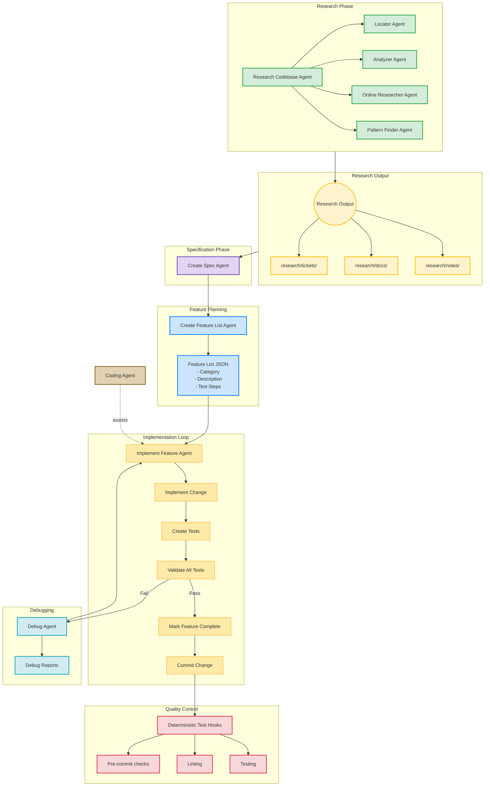

## Building on AI Coding Infrastructure

In our previous post on [AI Coding Infrastructure](/blog/ai-coding-infrastructure), we introduced the foundational layer for AI coding tools: project memory, mandatory skills, specialized sub-agents, ExecPlans, and autonomous execution with Ralph.

That infrastructure solved the **statelessness problem**—agents finally remembered your project context and followed proven workflows.

But we learned two critical lessons scaling it:

**Lesson 1: Less is more.** Having 114+ sub-agents and dozens of skills sounds powerful, but in practice it created confusion. Agents didn't know which specialist to call. Skills overlapped and contradicted each other. We learned to curate a focused set of agents and skills that work cohesively in a single workflow—not a buffet of options.

**Lesson 2: Specs are the memory layer.** Each coding session produced valuable insights that evaporated when the context window reset. Research findings, architectural decisions, debugging discoveries—all lost. We needed a system where work compounds rather than restarts.

**Agent Armory** is that system. It's a curated workflow with focused agents and skills designed to work together.

## The Core Insight: Lasting Memory Through Specs

In Agent Armory, specifications live in `specs/` and survive across sessions. When a new session starts, agents read the existing specs to understand context, decisions, and progress. Research happens within a session, but the **spec is what persists**.

The workflow follows a clear progression:

1. **Research** → Multiple agents analyze the codebase in parallel
2. **Spec Creation** → Synthesize research into a specification (this is what persists)
3. **Feature Decomposition** → Break the spec into discrete, implementable features
4. **Implementation** → Build each feature with tests and validation
5. **Pull Request** → Package changes for review

The spec is the source of truth that carries context forward. Future sessions read existing specs to understand decisions, progress, and architectural choices.

## Architecture: Three Primitives

Agent Armory operates through three interconnected primitives:

| Primitive | Role | Example |
|-----------|------|---------|
| **Commands** | Orchestrate workflows | `/research-codebase`, `/implement-plan`, `/create-pr` |
| **Agents** | Execute specialized tasks | Research Agent, Implementation Agent, Debug Agent |
| **Skills** | Inject domain knowledge | TDD patterns, debugging workflows, code review checklists |

**Six specialized agents** handle distinct phases: codebase research, pattern finding, spec creation, feature planning, implementation, and debugging. **Nine commands** orchestrate common workflows. **Two skills** enforce quality practices.

The key insight: agents work best when they do one thing well. A Research Agent that only researches produces better findings than a generalist trying to research-and-implement simultaneously.

## The Research-to-Execution Flywheel

Here's the complete workflow. Notice how research outputs feed into specs, specs decompose into features, and implementation failures loop back through debugging—all while accumulating documentation.



### Phase 1: Parallel Research

Four agents work simultaneously—this is where parallelization shines:

| Agent | Output | Persists To |
|-------|--------|-------------|
| **Locator** | Relevant code sections | `research/tickets/` |
| **Analyzer** | Patterns & architecture | `research/docs/` |
| **Online Researcher** | External docs & best practices | `research/docs/` |
| **Pattern Finder** | Structural patterns to follow | `research/notes/` |

**Why parallel?** Research tasks are independent. One agent finding authentication patterns doesn't block another analyzing database schemas.

### Phase 2: Specification

The create-spec command synthesizes all research into a single specification. Critically, this spec references the research documents—so anyone (human or agent) reading the spec can trace decisions back to their source.

Specs include: problem statement, proposed solution, architectural decisions, acceptance criteria, and links to relevant research files.

### Phase 3: Feature Decomposition

The create-feature-list command breaks specs into discrete features, each with:
```json
{
    "category": "functional",
    "description": "New chat button creates a fresh conversation",
    "steps": [
      "Navigate to main interface",
      "Click the 'New Chat' button",
      "Verify a new conversation is created",
      "Check that chat area shows welcome state",
      "Verify conversation appears in sidebar"
    ],
    "passes": false
}
```

<br></br>

**Learning**: Features must be small enough to implement in one session. If a feature requires multiple context switches, it's too big—decompose further.

### Phase 4: Serial Implementation

Features implement **one at a time**, each following this loop:

1. Implement the change
2. Create tests
3. Validate all tests pass (including previous features)
4. Mark complete & commit

**Why serial?** Parallel implementation creates merge conflicts and tangled dependencies making it harder to debug. Serial implementation with validation gates catches issues immediately. We only recommend parallel implementation when you're sure that you're working on areas that do not conflict with each other.

The create-debug-report command handles failures—producing diagnostic reports that feed back into the implementation loop rather than failing silently.

### Phase 5: Quality Gates

Deterministic hooks enforce standards on every commit:
- Pre-commit validation
- Linting and formatting
- Full test suite

These aren't optional. Broken code doesn't progress.

## What We Learned

### 1. Agents Deliver 40-60%, Not 100%

Set expectations correctly. Agent Armory gets you to 40-60% completion on complex features. The remaining work requires human judgment: edge cases, performance optimization, integration testing, architectural refinement.

This isn't a failure—it's the right division of labor. Agents handle the mechanical work; you handle the judgment calls and code review.

### 2. Research Quality Determines Everything

Garbage research produces garbage specs which produce garbage implementations. We spent significant time refining the Research Agents because their output quality cascades through the entire pipeline.

The Pattern Finder Agent was a late addition—and crucial. Without it, implementations ignored existing codebase conventions.

### 3. Feature Size Matters More Than You Think

Initially we let the Feature List Agent produce features of any size. Large features failed constantly—they exceeded context windows, created merge conflicts, and couldn't be validated atomically.

The fix: enforce small features. If implementing a feature requires more than one session, decompose it. This constraint improved completion rates dramatically.

### 4. Debug Loops Need Limits

Debugging agents can loop indefinitely on hard problems. We added a max-retry limit (default: 3) after which it escalates to human review rather than spinning forever.

### 5. Documentation Compounds

The `specs/` directories become genuinely valuable. New features reference old research. Debugging sessions read past notes. The system gets smarter over time.

This is the real payoff: lasting memory that compounds.

## You Own Decisions, Agents Own Execution

Agent Armory doesn't replace engineering judgment. It amplifies it.

- **You** approve specifications before implementation begins
- **You** review the feature list decomposition
- **You** decide when to accept agent output vs. iterate

Agents handle the mechanical work: researching codebases, writing boilerplate, running tests, creating PRs. They're excellent at execution. They're not (yet) excellent at decisions.

That division is the key to making this work.

## Getting Started

```bash
# Clone the repository
git clone https://github.com/flora131/agent-instructions.git

# Copy templates to your project
cp agent-instructions/AGENTS.md your-project/
cp -r agent-instructions/specs your-project/
cp -r agent-instructions/research your-project/

# In your AI coding tool, run:
# "Set up agent instructions for this project"
```

<br></br>

The agent analyzes your codebase, populates configuration with your patterns, and installs the workflow.

**Repository**: [github.com/flora131/agent-instructions](https://github.com/flora131/agent-instructions)

## Key Takeaways

- **Specs as lasting memory**: Specifications aren't throwaway prompts—they persist across sessions and inform all future work
- **Three primitives**: Commands orchestrate workflows, Agents execute specialized tasks, Skills inject domain knowledge
- **Research-to-execution flywheel**: A five-step workflow where research feeds specs, specs feed features, and documentation accumulates
- **Parallel research, serial implementation**: Multiple agents analyze simultaneously, but features implement one at a time with quality gates
- **You own decisions, agents own execution**: Expect 40-60% completion requiring human polish and refinement

## What's Next

Agent Armory is actively evolving.

If you're building with AI coding agents and want workflows that compound, Agent Armory is the next step.

PRs welcome.

---

## References

<div id="ref-1">[1] AI Coding Infrastructure - Previous post on foundational agent setup</div>
<div id="ref-2">[2] Agent Armory Repository - https://github.com/flora131/agent-instructions</div>
<div id="ref-3">[3] Superpowers Framework - https://github.com/obra/superpowers</div>
<div id="ref-4">[4] Anthropic Skills - https://github.com/anthropics/skills</div>
