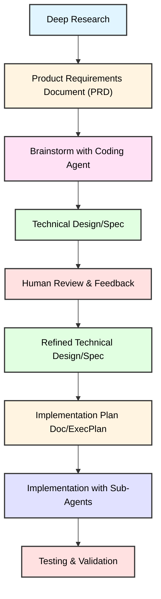

## The Problem

Over the last two weeks, I shipped 100,000 lines of high-quality code using AI agents. But here's what I learned talking to engineers across companies: we're being asked to adopt AI coding tools (Cursor, Windsurf, GitHub Copilot, Claude Code) without instructions, support, or infrastructure on how to get ROI in production.

When we onboard developers, we give them documentation, coding standards, proven workflows, and collaboration tools. When we "deploy" AI agents, we give them nothing. They start fresh every time. No project context, no memory of patterns, no proven workflows.

So I compiled **AI Coding Infrastructure**, the missing support layer that agents need. Five components:

1. **Project Memory** (AGENTS.md): Your tech stack, patterns, conventions that agents read automatically before every response
2. **Proven Workflows** (Skills): Battle-tested TDD, debugging, code review patterns agents MUST follow
3. **Specialization** (Sub-Agents): 114+ domain experts working in parallel, not one generalist
4. **Planning Systems** (ExecPlans): Self-contained living docs for complex features
5. **Autonomous Execution** (Ralph): Continuous loops for overnight autonomous development

## How It Works

### Project Memory

A single markdown file (`AGENTS.md` or `CLAUDE.md`) in your project root contains your tech stack, architectural patterns, and coding conventions. Agents automatically read this before every response, transforming them from stateless tools into stateful team members who know your project.

### Skills: Mandatory Workflow Discipline

Skills are proven patterns from [Anthropic Skills](https://github.com/anthropics/skills) <a href="#ref-2">[2]</a> and [Superpowers](https://github.com/obra/superpowers) <a href="#ref-3">[3]</a>: spec-driven development (SDD), test-driven development (TDD), systematic debugging, code review, brainstorming, etc.

**The difference**: Mandatory First Response Protocol. Before ANY response, agents MUST:

1. List available skills
2. Check if ANY skill matches
3. If yes → Read and follow it exactly

Agents can't rationalize "this is too simple for TDD" or "let me gather info first." If the skill applies, they MUST use it. This prevents the most common failure mode: shortcuts that seem reasonable but create bugs and technical debt.

_Credit: [Superpowers](https://github.com/obra/superpowers) framework by Jesse Hallett and obra <a href="#ref-3">[3]</a>_

### Custom Skills: Tailored to Your Workflow

You can also create custom skills for your unique workflows and patterns. One incredibly useful that I built is a meta-prompting skill called prompt-engineer that helps agents improve their own prompts based on project context and past failures. This was built using Anthropic's skill creation in [Anthropic Skills](https://github.com/anthropics/skills) <a href="#ref-2">[2]</a>.

_Credit: Built on Anthropic's Task tool <a href="#ref-2">[2]</a>_

### Sub-Agents: Parallel Specialization

114+ specialized agents (Python Pro, React Specialist, Cloud Architect, Security Engineer, ML Engineer, etc.) orchestrated by Agent Organizer. Up to 50 agents work in parallel on independent tasks.

Example: Building a notification system? Agent Organizer dispatches Backend Developer, WebSocket Engineer, Database Optimizer, and React Specialist all simultaneously.

_Credit: Uses Awesome Claude Code Subagents <a href="#ref-1">[1]</a>_

### ExecPlans: Self-Contained Living Documents

For complex features, agents auto-generate ExecPlans in `specs/`, which are fully self-contained documents that anyone can implement from without external context. Updated as work progresses. Includes Purpose, Progress, Decision Log, Plan of Work, Validation.

Nothing gets lost across context switches or handoffs.

### Ralph: Overnight Autonomous Development

Named after the [Ralph Wiggum meme](https://ghuntley.com/ralph/) <a href="#ref-4">[4]</a>, Ralph enables agents to run in continuous loops with no manual intervention.

**How it works**: Four files in `.ralph/` directory:
- `prompt.md` — Your instructions ("Port TypeScript to Python")
- `sync.sh` — Single iteration (reads prompt, runs Claude CLI, logs output)
- `ralph.sh` — Continuous loop (runs sync, sleeps 10s, repeats)
- `visualize.py` — Colored output showing progress

The agent works, commits changes, sleeps 10 seconds, continues until task completion. Manages its own context across iterations.

**Real-world results**:
- Ships 6+ repos overnight at YC hackathons
- Builds programming languages autonomously
- Migrates entire codebases between technologies

Best on cloud VMs (AWS EC2, Google Compute, DigitalOcean) running a [tmux](https://github.com/tmux/tmux) session.

_Credit: [Geoffrey Huntley](https://ghuntley.com/) <a href="#ref-4">[4]</a>_

## Real Results

Two weeks. 100,000 lines of production-quality code. I took the final 20% as the engineer, but the infrastructure got me to 80% much faster than before.

**What worked**:
- Sub-agents prevented bottlenecks through parallel execution
- Mandatory TDD caught bugs in design phase
- ExecPlans survived context switches
- Ralph built core features overnight

**Critical human touch**:
- **Reviewing agent-written plans**: Caught architectural issues and edge cases before implementation
- **Refining skills and sub-agents**: Customized agent behavior to match my workflow and this learning loop was essential
- Final integration testing, business logic decisions, performance optimization

This transforms you from a passive user into a power user who configures how agents think and collaborate.

## My AI-Augmented Development Workflow

The infrastructure above enables a research-driven development process that balances AI assistance with human oversight. Here's the workflow that produced 100k lines of quality code:



### Research & Requirements

Start with comprehensive research into the problem space: user needs, existing solutions, relevant technologies, and constraints. This research feeds into a **Product Requirements Document (PRD)** that articulates the *what* and *why*—problem statement, target users, success metrics, and business objectives—without prescribing implementation details.

### AI-Assisted Design

This is where AI coding infrastructure becomes critical. **Brainstorm with your coding agent** to explore technical possibilities. The agent leverages its knowledge of patterns and best practices to generate multiple approaches, identify challenges, and discuss trade-offs. This exploratory phase surfaces ideas that might not emerge from solo brainstorming.

Formalize the output into a **Technical Design/Spec** (often auto-generated as an ExecPlan). This describes the *how*: architecture decisions, API designs, data models, technology stack, system components, and scalability/security considerations.

### Human Validation Loop

**Critical checkpoint**: Experienced engineers review the AI-assisted spec. This human oversight catches edge cases, validates assumptions, and ensures alignment with organizational standards. This acknowledges that AI assistance needs human verification—I spent significant time here catching architectural issues before implementation.

Incorporate feedback into a **Refined Technical Design/Spec**. This might involve adjusting architecture, adding clarifications, or reconsidering technology choices. The refined spec represents the agreed-upon technical approach with human validation baked in.

### Execution

Break the refined spec into an **Implementation Plan Doc** (ExecPlans in `specs/`). This includes task decomposition, effort estimates, dependency mapping, and milestone definitions.

During **Implementation**, sub-agents work in parallel on independent tasks. Ralph handles overnight autonomous development for foundational features. Mandatory TDD skills catch bugs in the design phase.

**Testing** validates against both PRD objectives and technical spec requirements: unit tests, integration tests, performance testing, and final QA.

### Why This Works

**AI-augmented but human-validated**: Balances the speed and breadth of AI with the judgment and experience of senior engineers. AI assists exploration and implementation; humans validate critical decisions.

**Separation of concerns**: Clear distinction between product requirements (PRD), technical design (Spec), and execution planning (Plan Doc/ExecPlan). Each artifact serves its specific purpose.

**Feedback integration**: Explicit human review loop after initial spec ensures first drafts benefit from iteration before implementation begins.

**Research-driven**: Starting with deep research rather than jumping to requirements ensures decisions are grounded in solid understanding of the problem space.

This workflow is particularly effective for complex projects where upfront planning investment pays dividends, teams leveraging AI coding tools, and organizations wanting to maintain human control over critical technical decisions while benefiting from AI capabilities.

## 5-Minute Setup

1. Copy template files to your project (`AGENTS.md`/`CLAUDE.md`, `specs/`, optionally `.ralph/`)
2. Open in your AI coding tool (Cursor, Windsurf, GitHub Copilot, Claude Code)
3. Ask: **"Set up agent instructions, skills, and sub-agent support for this project"**

Agent analyzes your codebase and populates AGENTS.md, then installs 100+ skills and 114+ sub-agents to your config directory.

**You get**: Project memory, mandatory workflows, specialized agents, ExecPlan templates, Ralph setup.

**Repository**: [github.com/flora131/agent-instructions](https://github.com/flora131/agent-instructions) <a href="#ref-5">[5]</a>

## Why Open Source This?

Developers aren't seeing production ROI from AI coding tools. Without infrastructure and support, these tools aren't being maximized for their potential.

This infrastructure made the difference for me. From inconsistent results to 100,000 lines in two weeks. If it helps others build faster, it should be shared.

**PRs welcome** <a href="#ref-5">[5]</a>: Build skills for your workflow, create domain sub-agents, improve setup, find better ExecPlan patterns, extend Ralph.

We're at an inflection point. AI coding tools are deploying widely, but the infrastructure layer is missing. Let's build it together and make it easier and faster for developers to use.

## Credits

Built on excellent work by:
- **Superpowers** <a href="#ref-3">[3]</a>: Mandatory skill checking, TDD discipline, systematic debugging (Jesse Hallett, obra)
- **Anthropic Skills** <a href="#ref-2">[2]</a>: Skills system and reusable patterns framework
- **Ralph Method** <a href="#ref-4">[4]</a>: Continuous agent loops for autonomous development (Geoffrey Huntley)
- **Sub-Agent Architecture**: Anthropic's Task tool and orchestration patterns <a href="#ref-2">[2]</a>

## Additional Resources

### Complete Ralph Setup Script

The sync script that powers autonomous execution:

```bash
#!/usr/bin/env bash

cat .ralph/prompt.md | \
    claude -p --output-format=stream-json --verbose \
        --dangerously-skip-permissions --add-dir . | \
    tee -a .ralph/claude_output.jsonl | \
    uv run --no-project .ralph/visualize.py --debug
```

Place this in `.ralph/sync.sh` and make it executable. The continuous loop (`.ralph/ralph.sh`) repeatedly calls this script with 10-second sleeps between iterations.

---

## Key Takeaways

- **AI Coding Infrastructure** is the missing support layer for coding agents, providing project memory, proven workflows, specialization, planning systems, and autonomous execution
- **Mandatory skill checking** prevents agents from rationalizing away best practices, making it structurally impossible to skip proven workflows like TDD
- **114+ specialized sub-agents** enable parallel execution (up to 50 agents) with domain expertise instead of one generalist
- **Ralph method** enables overnight autonomous development through continuous agent loops
- **5-minute setup** via single prompt installs the complete infrastructure across any AI coding tool

### References

<div id="ref-1">[1] Awesome Claude Code Subagents - https://github.com/VoltAgent/awesome-claude-code-subagents</div>
<div id="ref-2">[2] Anthropic Skills Framework - https://github.com/anthropics/skills</div>
<div id="ref-3">[3] Superpowers Framework by Jesse Hallett and obra - https://github.com/obra/superpowers</div>
<div id="ref-4">[4] Ralph Wiggum Method by Geoffrey Huntley - https://ghuntley.com/ralph/</div>
<div id="ref-5">[5] Agent Instructions Repository - https://github.com/flora131/agent-instructions</div>
