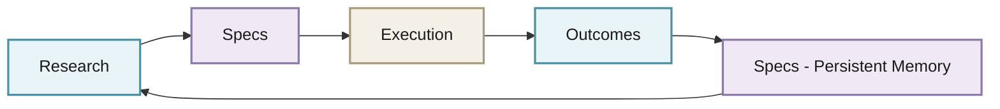
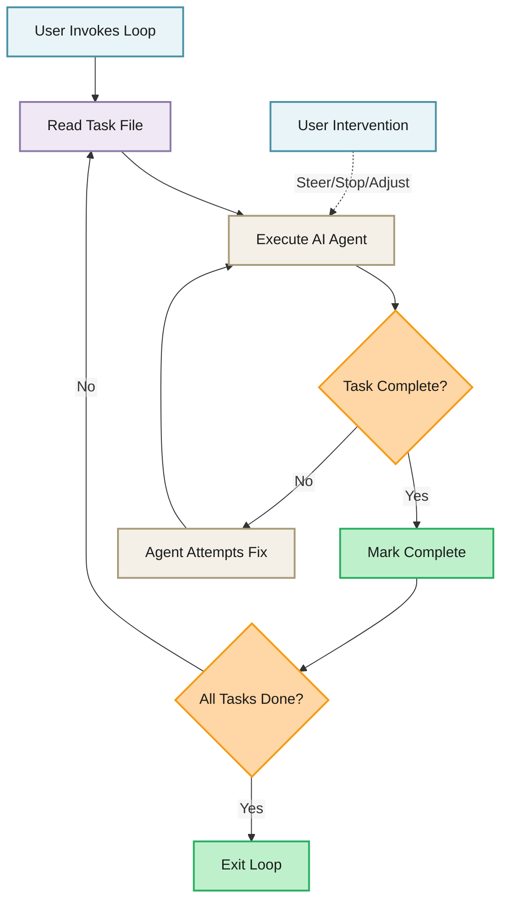
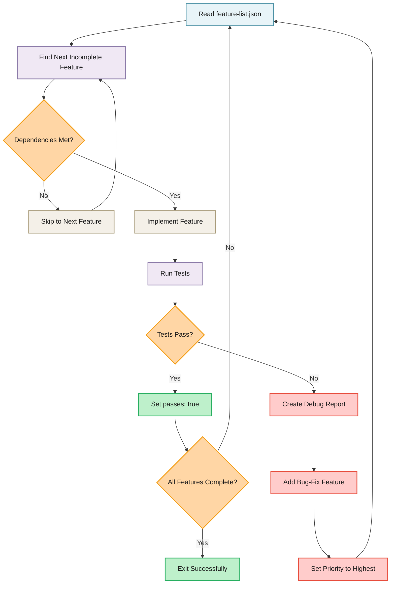
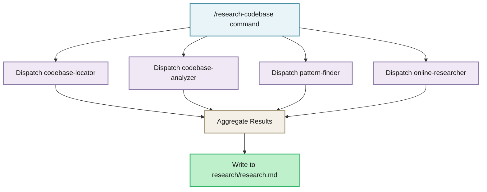

import { Image } from "astro:assets";
import InteractiveMermaid from "../../components/blog/InteractiveMermaid.astro";
import architectureSvg from "../../assets/images/blog/atomic/architecture.svg";
import BlogCTA from "../../components/blog/BlogCTA.astro";

## Introduction

AI coding agents are powerful, but they struggle with large codebases. They lack procedural memory, forget context between sessions, and can hallucinate completion without actually finishing work. For the ~70% of developers on Windows, the situation is even worse where most agentic tooling is optimized for Unix environments.

After shipping 100k+ lines of production code using AI agents, I built [Atomic](https://github.com/flora131/atomic) to solve these problems. But rather than just telling you to use it, this post breaks down the underlying patterns so you can understand them, adopt the pieces that fit your workflow, or build your own version entirely.

We'll cover:

1. [Understanding the Memory Gap in AI Agents](#understanding-the-memory-gap-in-ai-agents)
2. [Implementing Interactive Autonomous Loops (The Ralph Pattern)](#implementing-interactive-autonomous-loops-the-ralph-pattern)
3. [Building Test-Driven Contracts with Feature Lists](#building-test-driven-contracts-with-feature-lists)
4. [Managing Context Without Prompt Bloat](#managing-context-without-prompt-bloat)
5. [Designing Specialized Sub-Agents](#designing-specialized-sub-agents)
6. [Writing Cross-Platform Agent Scripts](#writing-cross-platform-agent-scripts)
7. [Integrating with Multiple AI Coding Tools](#integrating-with-multiple-ai-coding-tools)

Each section includes implementation details you can adapt to your own setup.

---

## Understanding the Memory Gap in AI Agents

Before building solutions, it helps to understand what's missing. AI coding agents have semantic memory (facts about code), but they lack two critical memory types:

| Memory Type | What It Is | Typical AI Agent Behavior | What You Need to Build |
| --- | --- | --- | --- |
| **Semantic** | Facts about code | "Auth is in `/src/auth`" | Already handled by most agents |
| **Episodic** | What happened | Fragmented across sessions | Persistent state files |
| **Procedural** | How to do things | Not trained for individual developers or teams | Automated workflows + commands |

### The Flywheel Pattern

The solution is a feedback loop where outputs become inputs for the next cycle:



**How to implement this yourself:**

1. **Research phase**: Create a `research/` directory where agents write their findings
2. **Spec phase**: Generate structured specifications from research (markdown or JSON)
3. **Execution phase**: Implement against the spec, tracking progress
4. **Outcome capture**: Update specs and progress files with learnings

The key insight: specs aren't just documentation. They're **persistent memory** that survives sessions and informs future agent runs.

---

## Implementing Interactive Autonomous Loops (The Ralph Pattern)

The Ralph methodology, created by Geoffrey Huntley, enables autonomous AI development through a simple mechanism: a loop that repeatedly feeds an AI agent a prompt until completion.

### The Core Concept

In its purest form, Ralph is just a bash loop:

```bash
while :; do
  cat PROMPT.md | claude-code
done
```

The agent sees its previous work through git history and file system artifacts. Each iteration refines the approach based on what broke. 

### Building Your Own Ralph Implementation

Here's a minimal implementation you can extend:

```bash
#!/bin/bash
# minimal-ralph.sh

MAX_ITERATIONS=${MAX_ITERATIONS:-50}
PROMPT_FILE=${PROMPT_FILE:-"PROMPT.md"}

iteration=0

while [ $iteration -lt $MAX_ITERATIONS ]; do
    ((iteration++))
    echo "=== Iteration $iteration ==="

    # Run your AI coding CLI with the prompt
    cat "$PROMPT_FILE" | claude  # or: cursor, copilot, opencode, etc.

    # Check for completion marker in the codebase
    if grep -q "ALL_FEATURES_COMPLETE" progress.txt 2>/dev/null; then
        echo "✓ All features complete!"
        exit 0
    fi

    # Optional: allow user interrupt
    read -t 1 -n 1 key 2>/dev/null || true
    if [ "$key" = "q" ]; then
        echo "User interrupted"
        exit 0
    fi
done

echo "Max iterations reached"
```

### Making It Interactive (Not Headless)

The key difference here is to run your agents in a terminal session rather than a subprocess. This gives you:

- Real-time streaming output
- Ability to steer mid-execution
- Full observability without logs



### Safety Mechanisms You Should Include

```python
# Key safety patterns to implement

# 1. Iteration limits
MAX_ITERATIONS = 50

# 2. Context window threshold (stop before exhaustion)
CONTEXT_THRESHOLD = 0.6  # 60% of context window

# 3. Rate limiting
RATE_LIMIT_CALLS = 100  # Per hour

# 4. Exit conditions
def should_exit():
    return (
        iterations >= MAX_ITERATIONS or
        context_usage >= CONTEXT_THRESHOLD or
        all_tasks_complete() or
        user_interrupted()
    )
```

---

## Building Test-Driven Contracts with Feature Lists

The most important pattern for reliable autonomous development: **executable specifications**. Instead of vague task descriptions, create contracts that define exactly what "done" means.

### The Feature Contract Structure

Here's a JSON schema you can adopt:

```json
{
  "projectName": "my-app",
  "features": [
    {
      "id": "001",
      "title": "User Authentication",
      "description": "Implement JWT-based authentication with refresh tokens",
      "acceptance_criteria": [
        "POST /api/auth/login returns JWT on valid credentials",
        "JWT expires after 15 minutes",
        "Refresh token endpoint extends session",
        "Invalid tokens return 401"
      ],
      "depends_on": [],
      "passes": false,
      "priority": 1
    },
    {
      "id": "002",
      "title": "User Registration",
      "description": "Email-based registration with validation",
      "depends_on": ["001"],
      "passes": false,
      "priority": 2
    }
  ]
}
```

### Why This Pattern Works

The autonomous loop exits **only when all features have `passes: true`**. This eliminates "I'm done" hallucinations because completion is verified against explicit criteria:



### Implementing the Feature Loop

Here's the logic your agent command should follow:

```markdown
# implement-feature command logic

1. Read feature-list.json
2. Find the first feature where passes: false
3. Check if all depends_on features have passes: true
   - If not, skip to next feature
4. Read any associated spec files for context
5. Implement the feature following existing codebase patterns
6. Write tests that verify each acceptance criterion
7. Run the test suite
8. If tests pass:
   - Update feature-list.json with passes: true
   - Commit with format: feat(feature-id): description
9. If tests fail:
   - Generate debug report
   - Add new bug-fix feature with priority: 0
   - Continue to next iteration
```

### Automatic Bug Escalation

When implementation fails, don't just retry instead create a tracked bug-fix task:

```json
{
  "id": "001-fix-1",
  "title": "Fix: User Authentication - JWT signing key not loaded",
  "description": "Environment variable JWT_SECRET not available in test environment",
  "depends_on": [],
  "passes": false,
  "priority": 0
}
```

This ensures bugs get addressed before moving on, and the fix becomes part of the permanent record.

---

## Managing Context Without Prompt Bloat

A common failure mode occurs when feeding agent output back as input until the context window explodes. The solution is **file system artifacts** as memory, not conversation history.

### The 60% Rule

Stop and checkpoint when context usage approaches 60%:

```python
CONTEXT_THRESHOLD = 0.6

def on_iteration_complete():
    if estimate_context_usage() >= CONTEXT_THRESHOLD:
        # Don't continue with bloated context
        write_progress_checkpoint()
        commit_work_in_progress()
        signal_handoff()  # Next iteration starts fresh
```

### How Agents Should Build Context

Each iteration reads state from the file system rather than conversation history:

```mermaid
%%{init: {
  'theme': 'default',
  'flowchart': {
    'htmlLabels': false,
    'wrap': true
  },
  'themeVariables': {
    'primaryColor': '#C5DBF7',
    'primaryTextColor': '#1a1a1a',
    'primaryBorderColor': '#4A7BA7',
    'secondaryColor': '#BEF0CB',
    'secondaryTextColor': '#1a1a1a',
    'secondaryBorderColor': '#27AE60'
  }
}}%%
flowchart LR
    subgraph iter1["Iteration N"]
        A1[Read progress.txt]:::primaryStyle --> B1[Read feature-list.json]:::primaryStyle
        B1 --> C1[Check git log]:::primaryStyle
        C1 --> D1[Analyze file state]:::primaryStyle
        D1 --> E1[Work on feature]:::secondaryStyle
        E1 --> F1[Commit changes]:::secondaryStyle
        F1 --> G1[Update progress.txt]:::secondaryStyle
    end

    subgraph iter2["Iteration N+1"]
        A2[Read progress.txt]:::primaryStyle --> B2[Read feature-list.json]:::primaryStyle
        B2 --> C2[Check git log]:::primaryStyle
        C2 --> D2[Fresh context, same state]:::primaryStyle
    end

    G1 -.->|File System| A2

    classDef primaryStyle fill:#C5DBF7,stroke:#4A7BA7,stroke-width:2px,color:#1a1a1a
    classDef secondaryStyle fill:#BEF0CB,stroke:#27AE60,stroke-width:2px,color:#1a1a1a
```



### Progress File Format

Design a progress file that captures session state:

```markdown
## Session Summary - 2025-01-27T14:30:00Z

### Completed
- 001: User Authentication - JWT implementation complete, all tests passing
- 002: User Registration - Email validation and storage complete

### In Progress
- 003: Password Reset - Email template created, token generation WIP

### Blockers
- SMTP configuration needed for password reset emails
- Awaiting decision on token expiration policy

### Next Steps
1. Complete token generation logic in /src/auth/reset.ts
2. Implement /api/auth/reset-password endpoint
3. Add integration tests for full reset flow

### Learnings
- JWT_SECRET must be set in both .env and .env.test
- Use bcrypt rounds=12 per existing auth patterns
```

### The Compact Command Pattern

Create a command that summarizes and checkpoints:

```markdown
# /compact command

Summarize the current session's progress:

1. Review all changes made (git diff)
2. Document completed features
3. Note blockers or partial work
4. Update progress.txt with:
   - Features completed this session
   - Current state of in-progress work
   - Known issues
   - Next steps for continuation
5. Commit the progress update
```

---

<BlogCTA />

## Designing Specialized Sub-Agents

Instead of one general-purpose agent, create specialists with focused responsibilities and restricted tool access.

### The Separation of Concerns Pattern

```
agents/
├── codebase-analyzer.md      # Understands code, doesn't modify
├── codebase-locator.md       # Finds files, returns locations only
├── codebase-pattern-finder.md # Discovers existing patterns
├── online-researcher.md      # Web access for external docs
└── debugger.md               # Diagnoses failures
```

### Agent Definition Template

Here's a template you can use for any AI coding tool that supports custom agents:

```markdown
---
name: agent-name
description: When this agent should be invoked
tools: Read, Grep, Glob  # Restricted tool access
---

You are a specialist at [specific task]. Your job is to [clear purpose].

## Constraints
- DO NOT [thing this agent should never do]
- DO NOT [another restriction]
- ONLY [the one thing this agent does]

## Approach
1. [Step one of how this agent works]
2. [Step two]
3. [Step three]

## Output Format
[Exactly what this agent should return]
```

### Example: Pattern Finder Agent

```markdown
---
name: codebase-pattern-finder
description: Finds similar implementations and usage patterns
tools: Read, Grep, Glob
---

You are a pattern librarian. Your job is to locate similar implementations
that can serve as templates for new work.

## Constraints
- DO NOT suggest improvements or better patterns
- DO NOT critique existing implementations
- DO NOT evaluate if patterns are good or bad
- ONLY show what exists in the codebase

## Pattern Categories to Search
- API routes and middleware
- Database queries and data access
- Component structure and state management
- Test setup and assertion patterns
- Error handling approaches

## Output Format
For each pattern found:
- Full file path with line numbers
- The actual code (not just snippets)
- Where else this pattern is used
- No editorial commentary
```

### Example: Code Analyzer Agent

```markdown
---
name: codebase-analyzer
description: Analyzes implementation details and code behavior
tools: Read, Grep, Glob
---

You are a specialist at understanding how code works. Your job is to analyze
implementation details, trace execution paths, and explain code behavior.

## Constraints
- DO NOT suggest improvements or modifications
- DO NOT critique code quality
- DO NOT recommend refactoring
- ONLY explain what the code does and how

## Analysis Approach
1. Identify entry points and public interfaces
2. Trace data flow through the system
3. Document dependencies and side effects
4. Explain error handling patterns
5. Note performance characteristics

## Output Format
Structured analysis with:
- Entry points identified
- Data flow description
- Dependencies listed
- Side effects documented
```

### Orchestrating Multiple Agents

Your main commands dispatch to specialists:



---

## Writing Cross-Platform Agent Scripts

If you're building tooling that others will use (or you work across Windows, macOS, and Linux), maintaining separate bash and PowerShell scripts creates maintenance burden and behavioral drift. A more robust approach: **write once in TypeScript, run everywhere with Bun**.

### The Problem with Dual Scripts

The naive approach is to maintain parallel implementations:

```
scripts/
├── ralph.sh      # Unix/macOS - bash syntax, jq for JSON
└── ralph.ps1     # Windows - PowerShell syntax, different JSON handling
```

This causes problems:

- **Behavioral drift**: Bug fixes in one script don't automatically apply to the other
- **Testing burden**: You need to test on multiple platforms
- **Feature disparity**: One platform often lags behind
- **Different dependencies**: bash needs `jq`, PowerShell has different JSON parsing

### The TypeScript + Bun Solution

[Bun](https://bun.sh/) is a fast JavaScript/TypeScript runtime that works identically on Windows, macOS, and Linux. Instead of shell scripts, write TypeScript:

```
hooks/
└── telemetry-session.ts   # Single file, runs everywhere
```

Claude Code hooks (and similar systems) invoke your script via:

```json
{
  "hooks": {
    "SessionStart": [{
      "hooks": [{
        "type": "command",
        "command": "bun \"$CLAUDE_PROJECT_DIR/.claude/hooks/session-start.ts\""
      }]
    }]
  }
}
```

### Why This Works

Bun provides:

1. **Native TypeScript execution:** No transpilation step, just `bun script.ts`
2. **Cross-platform Node.js APIs:** `fs`, `path`, `child_process` abstract OS differences
3. **Fast startup:** Sub-100ms cold starts, important for hooks that run frequently
4. **Single dependency:** Just install Bun, no node_modules needed for scripts

### Implementation Pattern: Platform-Agnostic Hook

Here's how to write a cross-platform hook that handles JSON, file operations, and process spawning:

```typescript
// hooks/session-telemetry.ts
import { readFileSync, writeFileSync, existsSync } from "fs";
import { join } from "path";
import { spawn } from "child_process";

interface HookInput {
  session_id: string;
  hook_event_name: string;
  cwd: string;
  transcript_path: string;
}

interface FeatureList {
  features: Array<{
    id: string;
    passes: boolean;
    title: string;
  }>;
}

// Read hook input from stdin (works identically on all platforms)
const input: HookInput = await Bun.stdin.json();

// Platform-agnostic path handling
const projectDir = process.env.CLAUDE_PROJECT_DIR || input.cwd;
const featureListPath = join(projectDir, "feature-list.json");
const progressPath = join(projectDir, "progress.txt");

// JSON parsing without external dependencies
function readFeatureList(): FeatureList | null {
  if (!existsSync(featureListPath)) return null;
  return JSON.parse(readFileSync(featureListPath, "utf-8"));
}

// Cross-platform timestamp
function timestamp(): string {
  return new Date().toISOString();
}

// Log session start with feature status
const features = readFeatureList();
if (features) {
  const complete = features.features.filter(f => f.passes).length;
  const total = features.features.length;

  const logEntry = `\n## Session ${input.session_id} - ${timestamp()}\n` +
    `Features: ${complete}/${total} complete\n`;

  // Append to progress file (works on Windows, macOS, Linux)
  if (existsSync(progressPath)) {
    const existing = readFileSync(progressPath, "utf-8");
    writeFileSync(progressPath, existing + logEntry);
  } else {
    writeFileSync(progressPath, logEntry);
  }
}

// Return context to Claude (via stdout JSON)
console.log(JSON.stringify({
  hookSpecificOutput: {
    hookEventName: "SessionStart",
    additionalContext: features
      ? `Feature progress: ${features.features.filter(f => f.passes).length}/${features.features.length}`
      : "No feature list found"
  }
}));
```

### Running AI Agents Cross-Platform

For the Ralph loop pattern, TypeScript gives you proper process control:

```typescript
// ralph.ts
import { spawn } from "child_process";
import { readFileSync, existsSync } from "fs";

const MAX_ITERATIONS = parseInt(process.env.MAX_ITERATIONS || "50");
const FEATURE_FILE = process.env.FEATURE_FILE || "feature-list.json";

interface FeatureList {
  features: Array<{ passes: boolean }>;
}

function readFeatures(): FeatureList {
  return JSON.parse(readFileSync(FEATURE_FILE, "utf-8"));
}

function allComplete(): boolean {
  const features = readFeatures();
  return features.features.every(f => f.passes);
}

async function runAgent(): Promise<number> {
  return new Promise((resolve) => {
    // spawn works identically on Windows/macOS/Linux
    const proc = spawn("claude", ["/implement-feature", FEATURE_FILE], {
      stdio: "inherit",  // Stream output to terminal
      shell: true        // Use shell for command resolution
    });

    proc.on("close", (code) => resolve(code || 0));
  });
}

// Main loop
for (let i = 0; i < MAX_ITERATIONS; i++) {
  console.log(`\n=== Ralph Iteration ${i + 1} ===\n`);

  if (allComplete()) {
    console.log("✓ All features complete!");
    process.exit(0);
  }

  await runAgent();
}

console.log("Max iterations reached");
```

Run it the same way on any platform:

```bash
bun ralph.ts
```

### Hook Configuration for Multiple Tools

The TypeScript approach works across Claude Code, OpenCode, and other tools that support hooks:

```json
// .claude/settings.json (Claude Code)
{
  "hooks": {
    "SessionStart": [{
      "hooks": [{
        "type": "command",
        "command": "bun \"$CLAUDE_PROJECT_DIR/.claude/hooks/session-start.ts\""
      }]
    }],
    "PostToolUse": [{
      "matcher": "Write|Edit",
      "hooks": [{
        "type": "command",
        "command": "bun \"$CLAUDE_PROJECT_DIR/.claude/hooks/post-edit.ts\""
      }]
    }]
  }
}
```

```json
// .opencode/opencode.json (OpenCode)
{
  "experimental": {
    "hook": {
      "file_edited": {
        "*.ts": [{
          "command": ["bun", ".opencode/hooks/on-edit.ts"]
        }]
      }
    }
  }
}
```

### DevContainer for Sandboxed Execution

For autonomous overnight runs, isolate the environment:

```json
// .devcontainer/devcontainer.json
{
  "name": "Agent Development",
  "image": "mcr.microsoft.com/devcontainers/base:ubuntu",
  "features": {
    "ghcr.io/devcontainers/features/node:1": {},
    "ghcr.io/devcontainers/features/python:1": {}
  },
  "runArgs": [
    "--network=none"
  ],
  "mounts": [
    "source=${localWorkspaceFolder},target=/workspace,type=bind"
  ]
}
```

---

## Integrating with Multiple AI Coding Tools

Design your command and agent structure to work across different tools.

### Directory Structure Pattern

```
your-project/
├── .claude/                    # Claude Code
│   ├── agents/
│   ├── commands/
│   └── settings.json
├── .github/                    # GitHub Copilot
│   └── prompts/
├── .cursor/                    # Cursor
│   └── rules/
├── .opencode/                  # OpenCode
│   ├── agent/
│   └── command/
├── CLAUDE.md                   # Claude Code context
├── AGENTS.md                   # Generic context (Copilot, Cursor, etc.)
└── .mcp.json                   # MCP server config
```

### Shared Context File

Create one canonical context file, symlink for tools that need different names:

```bash
# AGENTS.md is the source of truth
# Symlink for tools that expect different filenames
ln -s AGENTS.md CLAUDE.md
```

### Context File Template

```markdown
# Project Context

## Overview
[What this project does]

## Tech Stack
- Language: [e.g., TypeScript]
- Framework: [e.g., Next.js]
- Database: [e.g., PostgreSQL]
- Testing: [e.g., Vitest]

## Architecture
[Key architectural decisions]

## Patterns to Follow
- [Pattern 1]: [Where to find examples]
- [Pattern 2]: [Where to find examples]

## Commands Available
- /research-codebase: Deep codebase analysis
- /create-spec: Generate specifications
- /implement-feature: Feature implementation
- /compact: Session summarization

## Important Files
- feature-list.json: Feature tracking
- progress.txt: Session state
- research/: Research outputs
- specs/: Specifications
```

### MCP Server Configuration

For tools that support MCP (Model Context Protocol):

```json
// .mcp.json
{
  "mcpServers": {
    "deepwiki": {
      "command": "bunx",
      "args": ["@anthropic/deepwiki-mcp"]
    },
    "playwright": {
      "command": "docker",
      "args": [
        "run", "-i", "--rm", "--init",
        "--network=host",
        "mcr.microsoft.com/playwright/mcp"
      ]
    }
  }
}
```

---

## Putting It All Together

Here's how these patterns combine into a complete workflow:

<InteractiveMermaid height="700px" maxZoom={4}>
  <Image src={architectureSvg} alt="Atomic workflow architecture diagram showing the complete research-to-execution flywheel" />
</InteractiveMermaid>

### The Human-in-the-Loop Principle

These patterns work because **you own the decisions, agents own the execution**:

- Review specs before implementation (architecture decisions are yours)
- Review code after each feature (quality gate)
- Use compact/progress files to manage context
- The 40-60% rule: agents get you most of the way, you provide the polish

---

## Getting Started

You can implement these patterns from scratch, or use [Atomic](https://github.com/flora131/atomic) as a reference implementation to study and adapt.

### If Building Your Own

1. Start with the feature-list.json contract pattern
2. Add a progress.txt for episodic memory
3. Create 2-3 specialized agents (locator, analyzer, pattern-finder)
4. Build a simple Ralph loop script
5. Add the compact command for context management

### If Adapting Atomic

```bash
# Copy what you need
cp -r .claude/agents /path/to/your-project/.claude/
cp -r .claude/commands /path/to/your-project/.claude/

# Or just the patterns you want
cp .claude/commands/implement-feature.md /path/to/your-project/
```

### Prerequisites for Full Setup

- [bun](https://bun.sh/) or npm - For MCP servers
- [Docker](https://docs.docker.com/) - For sandboxed MCP servers
- [uv](https://docs.astral.sh/uv/) - For Python-based Ralph scripts
- [jq](https://jqlang.org/) - For JSON parsing in bash

---

## Conclusion

Reliable AI-assisted development comes down to a few key patterns:

1. **Persistent memory** through specs and progress files (not conversation history)
2. **Executable contracts** that define "done" explicitly
3. **Specialized agents** with focused responsibilities
4. **Interactive loops** with safety mechanisms
5. **Cross-platform support** from day one

These aren't complex to implement, but they require deliberate design. The Atomic repo demonstrates one way to combine them.

The goal is to ship production code reliably, whether you're manually stepping through each phase or running autonomous overnight loops.

PRs and Github issues to Atomic are welcome: [github.com/flora131/atomic](https://github.com/flora131/atomic)

---

## Resources

- **Atomic Repository**: [github.com/flora131/atomic](https://github.com/flora131/atomic) — Reference implementation
- **Ralph Methodology**: [ghuntley.com/ralph](https://ghuntley.com/ralph/) — Original technique by Geoffrey Huntley
- **Ralph Plugin (Official)**: [anthropics/claude-code/plugins/ralph-wiggum](https://github.com/anthropics/claude-code/blob/main/plugins/ralph-wiggum/README.md)
- **Anthropic Effective harnesses for long-running agents**: [Anthropic Blog Post](https://www.anthropic.com/engineering/effective-harnesses-for-long-running-agents)
- **Video Walkthrough**: [YouTube Tutorial](https://www.youtube.com/watch?v=Lq8-qzGfoy4)
