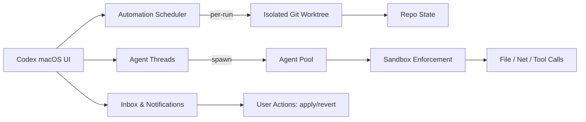

import InteractiveMermaid from "../../components/blog/InteractiveMermaid.astro";

## Key Takeaways

- Codex's macOS app is a desktop command center for supervising coding agents outside your IDE.
- Automations run on schedules in isolated Git worktrees, landing results in an inbox with desktop notifications.
- Multi-agent workflows are native: fan out tasks, reconcile results, and keep OS-level visibility.
- Sandbox modes gate file and network access; Apply/Revert keeps edits auditable.
- Market split: Cursor (IDE-first), Claude Code (terminal-first), Copilot (IDE agent), OpenCode (plan-first CLI). Codex is orchestration-first at the desktop layer.

## The Bet: From Files to Flows

Codex treats macOS as the surface—not VS Code or a shell. The app foregrounds an inbox for agent runs, an automations pane, and repo-aware context (Markdown/MDX preview, worktree selector). You supervise flows instead of living inside editor tabs. The UI ships with one-click worktree creation and git state visibility so you can jump between parallel efforts without touching the terminal.

## How Codex Is Built

- **Agent supervisor:** Manages concurrent threads and rate limits; can launch multiple agents per request.
- **Worktree engine:** Every automation or long-run task starts in a fresh Git worktree, isolating changes from your main branch.
- **Sandbox + permissions:** Read-only/workspace/full-access modes apply to automations and live threads; tool calls fail outside the allowed scope.
- **Preview/apply layer:** Rich Markdown/MDX preview with Apply actions mapping to git/CLI steps, keeping edits auditable.

### Component Flow



## Automations: Cron for Agents

Define a schedule (hourly/weekly). Each run executes in a disposable worktree, pipes findings to the inbox, and can be paired with skills for reusable playbooks. Desktop notifications fire on completion—no terminal tailing. Because runs are isolated, you can delete or merge results without polluting the main branch.

## Differentiators vs. The Field

- **Cursor 2.0 (IDE-first):** In-editor multi-agents in their own worktrees; optimized for code-in-tab flow.
- **Claude Code 2.1.x (terminal-first):** Lives in your shell; skill hot-reload; great for power-terminal users.
- **GitHub Copilot Agent Mode (IDE + repo graph):** Autonomous multi-file edits inside VS Code; tied to editor session and GitHub identity.
- **OpenCode / OpenAgents (plan-first, OSS):** CLI agents follow explicit plans with approval gates; model-agnostic.
- **Codex (orchestration-first):** OS-level inbox, scheduled automations, and cross-repo supervision without marrying you to a single editor.

### Philosophy Snapshot

```mermaid
mindmap
  root((Agent Tools))
    Codex:::focus
      desktop orchestration
      inbox + automations
      worktree isolation
    Cursor
      IDE-first
      in-editor multi-agents
      browser tool GA
    Claude_Code
      terminal-first
      skill hot-reload
      Vim/ctrl-B ergonomics
    Copilot
      IDE agent mode
      next-edit suggestions
      VS Code centric
    OpenCode
      plan-first CLI
      OSS, approval gates
classDef focus fill:#1c7ed6,stroke:#0b3d91,color:white;
```

## Security & Control

Sandbox modes propagate to background runs; commands outside policy fail. This keeps unattended automations from overreaching while still allowing full access when you opt in. Apply/Revert actions give you a panic button when exploratory agent sessions go sideways.

## Where This Could Go: OS-Level Agenting Beyond Code

Because Codex lives at the macOS layer (not just inside an editor), it can evolve into a general computer-use agent for developers:

- **Cross-app tasks:** Search the web, pull docs, drop findings into the inbox, then open the repo worktree that needs a change.
- **Context fusion:** Combine browser results, local files, calendars, and issue trackers into a single plan before touching code.
- **Hands-off runs:** Schedule morning briefings that scan logs, security alerts, and release notes, then open targeted diffs or drafts.
- **User-intent safety:** OS-level sandboxing and explicit Apply/Revert make higher-permission tasks (browser automation, file moves) reviewable.

Is this reasonable?

- **Why yes:** macOS accessibility APIs and sandbox permissions already allow controlled cross-app automation; worktree isolation reduces blast radius.
- **Why not (yet):** Full computer-use agents need robust browser automation, consistent app accessibility, and org policy guardrails. Without strong approval UX and audit, cross-app automation could become noisy or risky.
- **Pushback:** If agent actions sprawl beyond code, teams will demand policy, logging, and role separation. Expect a deliberate rollout: start with dev-surface tasks (docs, issues, PRs) before general “web errands.”

## How to Pilot It

1. Point Codex at a repo; enable automations for tests and dependency diffs.
2. Keep Cursor/Copilot for inline coding; let Codex handle orchestration and notifications.
3. Standardize safe worktree paths; train teams on Apply/Revert flows.
4. Store prompts as reusable skills; schedule them once stable.

## Closing

Codex bets that the future of coding looks less like editing files and more like supervising agents with clear jobs, schedules, and guardrails. If Cursor optimizes for coding speed and Claude Code for terminal power, Codex optimizes for coordination—turning your laptop into an agent control tower with room to expand into full computer-use automation.
