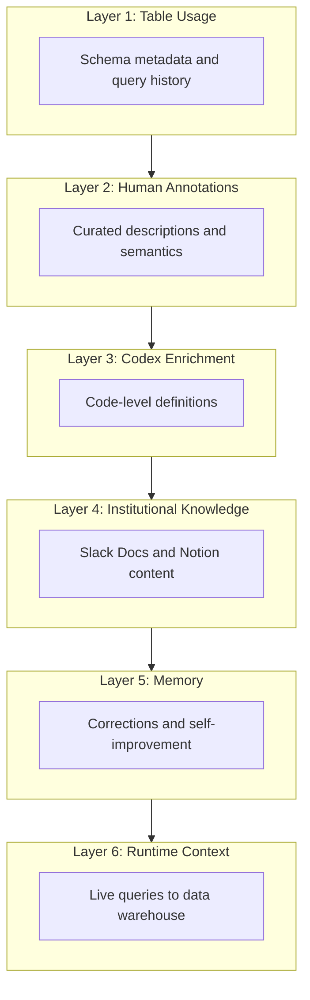
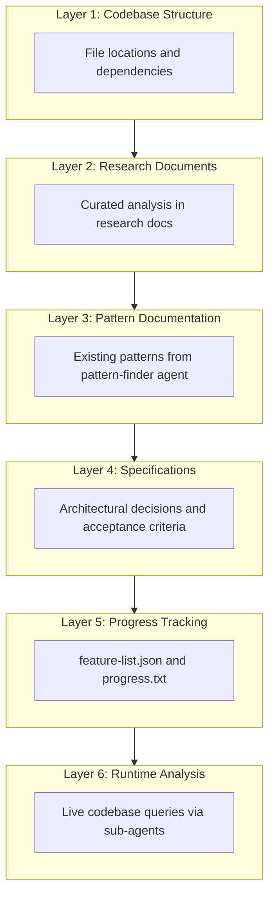
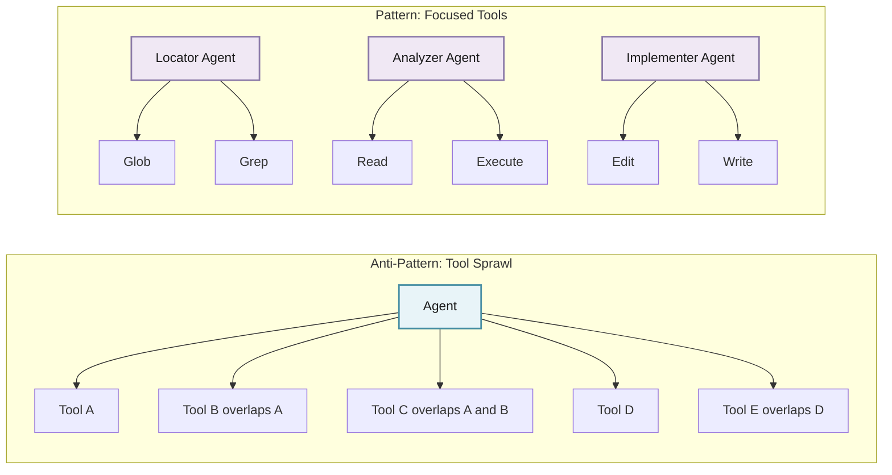
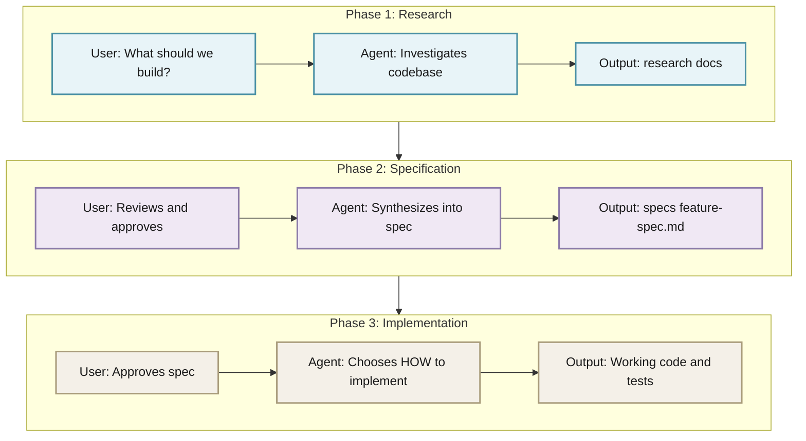
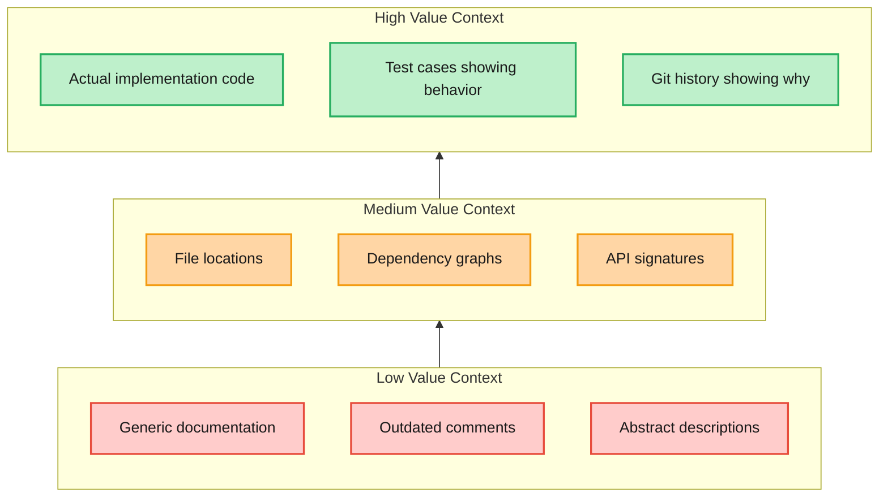

import InteractiveMermaid from "../../components/blog/InteractiveMermaid.astro";

## The Convergence

OpenAI recently published a deep dive on their internal data agent, a tool powered by GPT-5.2 that serves 3,500+ users querying 600 petabytes of data across 70,000 datasets. It is available through Slack, web interfaces, IDEs, and MCP connectors.

When I read through their architecture, I noticed something striking: the patterns they converged on after building at massive scale are nearly identical to what was discovered building [Atomic](https://github.com/flora131/atomic), a 3,000-line meta-framework CLI for AI coding agents.

This is not coincidence. It reveals something fundamental about how reliable AI agents need to be structured, regardless of scale.

In this post, I will break down the architectural parallels and extract the lessons that matter for anyone building AI coding tools.

## OpenAI's Six-Layer Context Architecture

OpenAI's data agent is built around multiple layers of context that ground it in their data and institutional knowledge. Without this layered approach, even strong models produce wrong results.

Here is their architecture:



Each layer serves a distinct purpose:

| Layer | What It Provides | Why It Matters |
|-------|------------------|----------------|
| **Table Usage** | Schema metadata, historical queries, table lineage | Tells the agent what exists and how it has been used |
| **Human Annotations** | Curated descriptions, business meaning, known caveats | Captures intent that cannot be inferred from schemas |
| **Codex Enrichment** | Code-level definitions derived from the codebase | Reveals how data is actually constructed |
| **Institutional Knowledge** | Slack, Docs, Notion content about launches, incidents, metric definitions | Provides organizational context beyond the data |
| **Memory** | Corrections, learned nuances, user feedback | Enables continuous improvement without retraining |
| **Runtime Context** | Live queries when existing context is stale | Handles edge cases and validates assumptions |

The key insight: each layer addresses a different failure mode. Table usage alone does not tell you business intent. Human annotations do not capture derivation logic. Memory captures corrections that would otherwise be lost.

## Atomic's Parallel Architecture

Building Atomic brings us to a remarkably similar layered structure for coding agents:



Here is how Atomic's layers map to OpenAI's:

| OpenAI Layer | Atomic Equivalent | Implementation |
|--------------|-------------------|----------------|
| Table Usage | Codebase Structure | codebase-locator agent discovers file locations and dependencies |
| Human Annotations | Research Documents | research docs with curated analysis and context |
| Codex Enrichment | Pattern Documentation | codebase-pattern-finder extracts existing implementation patterns |
| Institutional Knowledge | Specifications | specs capture architectural decisions and rationale |
| Memory | Progress Tracking | feature-list.json and progress.txt maintain state across sessions |
| Runtime Context | Runtime Analysis | Sub-agents query the live codebase when needed |

The parallel is not superficial. Both systems solve the same fundamental problem: grounding AI agents in context that persists beyond a single conversation.

## Three Lessons from the Convergence

OpenAI's writeup surfaces three lessons that directly mirror what was learned building Atomic at 1/200,000th the scale.

### Lesson 1: Less Is More

**OpenAI's discovery:** Early on, they exposed their full tool set to the agent and quickly ran into problems with overlapping functionality. While this redundancy can be helpful for specific custom cases and is more obvious to a human when manually invoking, it is confusing to agents. To reduce ambiguity and improve reliability, they restricted and consolidated certain tool calls.

**What this means in practice:**

When you give an agent 50 tools with overlapping capabilities, it wastes tokens reasoning about which tool to use and often picks wrong. The solution is not more tools, it is fewer, more focused tools with clear boundaries.

**How Atomic implements this:**

Each sub-agent in Atomic has explicitly restricted tool access:

```yaml
# codebase-locator agent definition
name: codebase-locator
description: Finds WHERE code lives - files directories modules
tools: Read, Grep, Glob
```

```text
You are a specialist at locating code. Your job is to find WHERE
things exist in the codebase.

## Constraints
- DO NOT analyze code behavior
- DO NOT suggest improvements
- DO NOT evaluate code quality
- ONLY return locations with file paths

## Output Format
For each search:
- Full file path
- Line numbers where relevant
- Brief description of what is at that location
```

Compare this to a hypothetical do everything agent:

```yaml
# BAD: Overlapping capabilities create confusion
name: general-purpose-agent
tools: Read, Write, Edit, Grep, Glob, Bash, WebSearch
```

```text
You can analyze code, write code, search the web, run commands...
```

The restricted agent knows exactly what it should do. The general-purpose agent has to reason about which capability to use for every action.

**The pattern for your own agents:**



**Actionable takeaway:** Audit your agent's tool access. For each tool, ask: Is there another tool that does something similar? If yes, either consolidate or create separate agents with non-overlapping tool sets.

### Lesson 2: Guide the Goal, Not the Path

**OpenAI's discovery:** They also discovered that highly prescriptive prompting degraded results. While many questions share a general analytical shape, the details vary enough that rigid instructions often pushed the agent down incorrect paths. By shifting to higher-level guidance and relying on GPT-5's reasoning to choose the appropriate execution path, the agent became more robust and produced better results.

**What this means in practice:**

Telling an agent exactly how to accomplish something assumes you know the best path. But the best path varies based on context. Over-specification leads to failure when the situation does not match your assumptions.

**How Atomic implements this:**

Atomic separates research from specs from implementation. The user guides the goal at each phase, but the agent owns the execution path.



The implement-feature command demonstrates this principle:

```text
# implement-feature command (simplified)

Read the approved specification and feature list.
Implement the next incomplete feature.

## What You Decide (Agent Owns Execution)
- Which files to modify
- What patterns to follow (based on existing codebase)
- How to structure the implementation
- What tests to write

## What is Fixed (User Owns Goals)
- The feature requirements (from spec)
- Acceptance criteria (from feature-list.json)
- Quality gates (tests must pass)
```

Compare this to over-specified prompting:

```text
# BAD: Over-specified implementation instruction
To implement authentication:
1. Create file src/auth/login.ts
2. Import bcrypt from bcrypt
3. Create function validatePassword(input, hash)
4. Use bcrypt.compare()
5. Return boolean result
...
```

This breaks when:
- The project uses a different directory structure
- The project already has auth utilities
- The project uses argon2 instead of bcrypt
- Any assumption does not match reality

**The pattern for your own agents:**

Define what success looks like, not how to achieve it:

```json
{
  "features": [
    {
      "id": "auth-001",
      "title": "Password Validation",
      "acceptance_criteria": [
        "Valid passwords return true",
        "Invalid passwords return false",
        "Timing attacks are mitigated",
        "Follows existing auth patterns in codebase"
      ],
      "passes": false
    }
  ]
}
```

**Actionable takeaway:** Replace step-by-step instructions with acceptance criteria. Let the agent figure out the path; verify the outcome.

### Lesson 3: Meaning Lives in Code

**OpenAI's discovery:** Schemas and query history describe a table's shape and usage, but its true meaning lives in the code that produces it. Pipeline logic captures assumptions, freshness guarantees, and business intent that never surface in SQL or metadata. By crawling the codebase with Codex, their agent understands how datasets are actually constructed.

**What this means in practice:**

Documentation lies. Comments go stale. But the code that produces data (or implements features) is the source of truth. An agent that can read and understand the actual implementation has context that no metadata layer can provide.

**How Atomic implements this:**

The codebase-pattern-finder agent does not just find files, it extracts actual implementation patterns:

```text
# codebase-pattern-finder agent

You are a pattern librarian. Find similar implementations that
can serve as templates.

## What to Extract
For each pattern found, provide:
- Full file path with line numbers
- The ACTUAL CODE (not summaries)
- Other places this pattern is used
- No editorial commentary
```

Here is an example of what the pattern-finder outputs:

**Authentication Pattern**
- **Location:** src/auth/session.ts:45-67
- **Also used in:** src/auth/refresh.ts:23-41

```typescript
export async function validateSession(token: string): Promise<Session | null> {
  const decoded = await verifyJWT(token, config.jwtSecret);
  if (!decoded) return null;

  const session = await db.sessions.findUnique({
    where: { id: decoded.sessionId },
    include: { user: true }
  });

  if (!session || session.expiresAt < new Date()) {
    return null;
  }

  return session;
}
```

**Pattern notes:** Uses early-return style, includes user relation, checks expiration explicitly.

When the implementation agent later needs to add authentication to a new endpoint, it has the actual code pattern, not a description of what authentication should look like.

**The knowledge hierarchy:**



**How specs capture meaning:**

In Atomic, specifications are not just requirements. They capture the why behind decisions:

```text
# specs/authentication-spec.md

## Decision: JWT with Refresh Tokens

### Why Not Session Cookies?
- Mobile clients cannot reliably handle cookies
- Existing API clients expect Bearer tokens
- See research docs 2025-01-15-auth-analysis.md for full comparison

### Why 15-Minute Access Token Expiry?
- Balances security (short window) with UX (not too many refreshes)
- Matches existing patterns in src/auth/config.ts
- Security review approved this duration (Slack thread: security-2025-01-10)

### Implementation Pattern to Follow
See src/auth/session.ts:45-67 for the established validation pattern.
```

**Actionable takeaway:** When building context for your agent, prioritize:
1. Actual code over documentation
2. Tests over comments (tests show real expected behavior)
3. Git history for why context
4. Specs that link back to code locations

## The Scale-Invariant Pattern

Here is what the convergence reveals: layered context with clear boundaries beats throwing everything into one massive prompt.

OpenAI discovered this managing petabytes. Atomic discovered it managing a few thousand lines of markdown specs. The infrastructure changes with scale, but the architecture does not.

```mermaid
%%{init: {
  'theme': 'default',
  'flowchart': {
    'htmlLabels': false,
    'wrap': true
  },
  'themeVariables': {
    'primaryColor': '#E8F4F8',
    'primaryTextColor': '#1a1a1a',
    'primaryBorderColor': '#4A90A4',
    'secondaryColor': '#F0E8F4',
    'secondaryTextColor': '#1a1a1a',
    'secondaryBorderColor': '#8B7AA8',
    'tertiaryColor': '#F4F0E8',
    'tertiaryTextColor': '#1a1a1a',
    'tertiaryBorderColor': '#A89B7A'
  }
}}%%
flowchart TB
    subgraph principle["The Scale-Invariant Principle"]
        P1["Layered Context"]:::primaryStyle
        P2["Clear Boundaries"]:::primaryStyle
        P3["Persistent Memory"]:::primaryStyle
        P4["Specialized Agents"]:::primaryStyle
        P5["Goal-Oriented Prompting"]:::primaryStyle
    end

    subgraph openai["OpenAI Implementation"]
        O1["6 context layers with RAG"]:::secondaryStyle
        O2["Tool consolidation"]:::secondaryStyle
        O3["Memory system with corrections"]:::secondaryStyle
        O4["Domain-specific retrievers"]:::secondaryStyle
        O5["High-level guidance"]:::secondaryStyle
    end

    subgraph atomic["Atomic Implementation"]
        A1["6 context layers in filesystem"]:::tertiaryStyle
        A2["Restricted tool access per agent"]:::tertiaryStyle
        A3["Specs and progress.txt"]:::tertiaryStyle
        A4["6 specialized sub-agents"]:::tertiaryStyle
        A5["Acceptance criteria not steps"]:::tertiaryStyle
    end

    P1 --- O1
    P1 --- A1
    P2 --- O2
    P2 --- A2
    P3 --- O3
    P3 --- A3
    P4 --- O4
    P4 --- A4
    P5 --- O5
    P5 --- A5

    classDef primaryStyle fill:#E8F4F8,stroke:#4A90A4,stroke-width:2px,color:#1a1a1a
    classDef secondaryStyle fill:#F0E8F4,stroke:#8B7AA8,stroke-width:2px,color:#1a1a1a
    classDef tertiaryStyle fill:#F4F0E8,stroke:#A89B7A,stroke-width:2px,color:#1a1a1a
```

<InteractiveMermaid height="500px">



</InteractiveMermaid>

**Why this pattern emerges independently:**

1. **Context windows are finite.** You cannot dump everything into a prompt. Layers let you load relevant context on demand.

2. **Agents need grounding.** Without structured context, agents hallucinate. Layers provide verifiable sources of truth.

3. **Work needs to persist.** Sessions end. Context resets. File-based artifacts survive.

4. **Specialization reduces errors.** General-purpose tools create ambiguity. Focused tools have clear success criteria.

5. **Goals are stable; paths are not.** What you want to achieve changes slowly. How you achieve it varies with every situation.

## Implementing These Patterns

If you are building AI coding agents or tools, here is how to apply these lessons:

### 1. Design Your Context Layers

Map out what context your agent needs and where it comes from:

```typescript
// Example: Context layer configuration
interface ContextLayers {
  // Layer 1: What exists
  codebaseStructure: {
    source: 'glob + grep',
    updates: 'on-demand',
    agent: 'codebase-locator'
  };

  // Layer 2: Curated understanding
  researchDocs: {
    source: 'research/docs/*.md',
    updates: 'per-session',
    agent: 'codebase-analyzer'
  };

  // Layer 3: Implementation patterns
  patterns: {
    source: 'extracted from codebase',
    updates: 'per-feature',
    agent: 'pattern-finder'
  };

  // Layer 4: Decisions and rationale
  specs: {
    source: 'specs/*.md',
    updates: 'per-project',
    agent: 'human + spec-generator'
  };

  // Layer 5: Session state
  progress: {
    source: 'feature-list.json + progress.txt',
    updates: 'per-feature',
    agent: 'implementation-agent'
  };

  // Layer 6: Live verification
  runtime: {
    source: 'live codebase queries',
    updates: 'on-demand',
    agent: 'any agent with Read access'
  };
}
```

### 2. Restrict Tool Access Per Agent

Create agent definitions with explicit tool boundaries. Here is a template:

**Agent Header (YAML):**

```yaml
name: agent-name
description: when to invoke this agent
tools: ONLY the tools this agent needs
```

**Agent Body:**

```text
You are a specialist at specific capability.

## You MUST
- Primary responsibility
- Secondary responsibility

## You MUST NOT
- Explicitly forbidden action
- Another forbidden action

## Output Format
Exactly what this agent returns
```

### 3. Use Acceptance Criteria, Not Instructions

Replace procedural prompts with outcome-based contracts:

```json
{
  "feature": "User Login",
  "acceptance_criteria": [
    "POST /api/auth/login accepts email and password",
    "Returns JWT on valid credentials",
    "Returns 401 on invalid credentials",
    "Follows existing auth patterns in src/auth/",
    "Includes test coverage for happy and error paths"
  ]
}
```

### 4. Make Memory Persistent

Choose a memory strategy that survives session boundaries:

```text
project/
├── research/
│   └── docs/           # Layer 2: Curated understanding
│       └── YYYY-MM-DD-topic.md
├── specs/              # Layer 4: Decisions
│   └── feature-spec.md
├── feature-list.json   # Layer 5: Progress tracking
├── progress.txt        # Layer 5: Session state
└── .git/               # Layer 6: History and verification
```

## Conclusion

OpenAI built their data agent to serve thousands of users across petabytes of data. Atomic is here to help individual developers ship code with AI assistance. The scale is different by orders of magnitude, but the architecture converged on the same patterns:

1. **Layered context** that loads relevant information on demand
2. **Tool consolidation** that reduces ambiguity
3. **Goal-oriented prompting** that lets agents choose execution paths
4. **Persistent memory** through specs and progress tracking
5. **Specialized agents** with restricted capabilities

These patterns work because they address fundamental properties of how LLMs operate: finite context windows, tendency to hallucinate without grounding, and strength at reasoning when given clear goals.

Scale changes the infrastructure. It does not change the architecture.

If you are building AI coding tools, start with these patterns. They have been validated at both ends of the scale spectrum.

---

## Resources

- **Atomic Repository**: [github.com/flora131/atomic](https://github.com/flora131/atomic)
- **OpenAI Data Agent Blog Post**: [openai.com/index/inside-our-in-house-data-agent](https://openai.com/index/inside-our-in-house-data-agent/)
- **Previous Post**: [Building Reliable AI Coding Agent Infrastructure](/blog/building-reliable-ai-coding-agent-infrastructure)
- **Atomic Workflow Overview**: [Atomic: Automated Procedures and Memory for AI Coding Agents](/blog/atomic-workflow)
