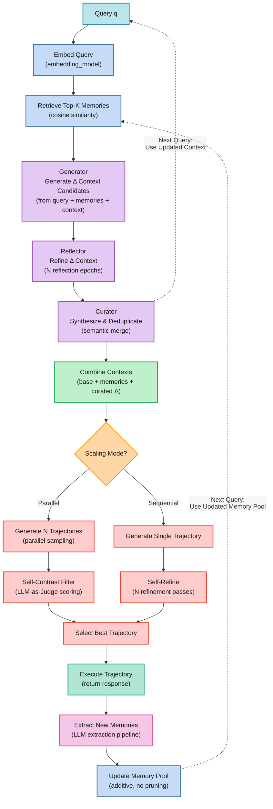

## The Challenge: Learning Without Retraining

Modern LLM agents face a fundamental constraint: they can't continuously improve from real-world experience without expensive retraining cycles. When deployed, they encounter edge cases, domain-specific patterns, and novel scenarios that expose gaps in their base capabilities. Current approaches either ignore this drift or require periodic fine-tuning, both suboptimal for production systems.

Two recent frameworks address this challenge from complementary angles: **ReasoningBank with Memory-aware Test-Time Scaling (MaTTS)** learns from structured reasoning patterns, while **Agentic Context Engineering (ACE)** incrementally refines operational context. This post synthesizes these frameworks and demonstrates how their integration creates a powerful architecture for continuous learning systems.

## Two Complementary Frameworks

### ReasoningBank + MaTTS: Learning from Structured Experience

ReasoningBank transforms agent trajectories into structured memory items—JSON objects containing titles, descriptions, and reasoning patterns. Rather than storing raw trajectories, it distills them into retrievable strategies:

```json
{
  "title": "Navigate nested menu via hover interaction",
  "description": "Hover over parent menu to reveal submenu options",
  "content": "When target is in nested menu: (1) identify parent, (2) hover to trigger submenu, (3) click target",
  "embedding": [...]
}
```

**Memory-aware Test-Time Scaling (MaTTS)** amplifies this through two modes:
- **Parallel scaling**: Generate k diverse trajectories (k=3 to k=5), use self-contrast to identify robust patterns, select best via LLM-as-judge
- **Sequential scaling**: Iteratively refine single trajectory over k passes

Retrieval uses cosine similarity on embedded queries. Retrieved memories augment the LLM prompt as additional system instructions, creating a feedback loop: better experiences → better memories → better retrieval → better decisions.

**Results**: +8.3% success rate on WebArena, +7.2% on Mind2Web, 34.2% relative improvement via MaTTS scaling, 16% fewer interaction steps on SWE-Bench-Verified.

### Agentic Context Engineering: Incremental Adaptation

ACE maintains context as bullet-point heuristics, updating incrementally rather than rewriting completely. A three-stage pipeline refines context:

1. **Generator**: Proposes 5-10 delta context bullets based on execution feedback
2. **Reflector**: Iteratively refines over 3-5 epochs (clarity → actionability → conciseness)
3. **Curator**: Merges refined deltas with semantic de-duplication (cosine similarity > 0.85)

The key insight: delta updates (ΔC<sub>t</sub>) are dramatically cheaper than full rewrites. Context evolves as C<sub>t+1</sub> = C<sub>t</sub> + ΔC<sub>t</sub>, maintaining compactness through embedding-based pruning.

**Results**: +17.1% accuracy on agent benchmarks, 86.9% latency reduction in context adaptation, 83.6% reduction in token costs.

## Real-World Applications

### ReasoningBank + MaTTS: Pattern-Heavy Domains

**Web navigation (WebArena, Mind2Web)**:
- Repeated UI patterns: nested menus, multi-step forms, pagination
- ReasoningBank captures interaction strategies ("hover parent menu to reveal submenu")
- MaTTS parallel mode (k=3) discovers robust navigation across layout variations
- After 50 interactions: 30+ reusable DOM traversal patterns

**Code repository tasks (SWE-Bench)**:
- Recurring patterns: type mismatches, import errors, test failures
- ReasoningBank stores diagnostic strategies ("check function signature compatibility")
- Sequential MaTTS (k=5) refines multi-file reasoning
- Example memory: "verify dependency injection before debugging runtime errors"

### ACE Alone: Incremental Domain Learning

**Project-specific coding assistants**: Learn codebase conventions during development sessions.
- Accumulates rules: "Use CustomError base class," "Database queries in repositories/"
- Delta updates add conventions without regenerating existing rules
- Reflection refines clarity: "Use CustomError" → "Extend CustomError base class for domain exceptions"
- Semantic de-duplication prevents redundant rules
- 86.9% latency reduction critical for frequent context updates

**Generalizes to**: Customer support (product policies), content moderation (guideline updates), personal assistants (user preferences), any scenario requiring incremental knowledge accumulation with low-latency evolution.

### Unified Framework: Production Automation

**Enterprise SaaS automation (Salesforce, HubSpot)**:
- ReasoningBank: UI interaction patterns (click sequences, field navigation)
- ACE: Client-specific rules ("Client X requires 'Enterprise' tag on leads >$50k")
- MaTTS parallel (k=3): Handles platform updates and custom layouts via multi-trajectory exploration
- Synergy: Memories provide "how to navigate," context provides "what rules apply per client"

## Unified Architecture: Closed-Loop Learning

Integrating these frameworks creates synergistic learning loops: <br/>
**1. Memory-Informed Context**: Retrieved reasoning patterns from ReasoningBank guide ACE's delta context generation <br/>
**2. Context-Guided Trajectories**: Evolved context shapes MaTTS trajectory exploration <br/>
**3. Trajectory-Enriched Memory**: New experiences expand ReasoningBank continuously <br/>
**4. Feedback-Driven Refinement**: Execution outcomes refine both memory and context <br/>

### System Architecture



## Key Implementation Insights

### 1. Memory Quality Over Quantity

Structure matters. ReasoningBank's JSON format (title, description, content, embedding) enables precise retrieval. Store reasoning patterns, not raw trajectories.

```python
# Good: Structured extraction
memory = {
    'title': 'Navigate nested menu via hover',
    'description': 'Hover parent to reveal submenu',
    'content': '(1) identify parent, (2) hover, (3) click target',
    'embedding': embed(content)
}
```

### 2. Incremental Beats Rewrite

ACE's delta updates reduced latency by **86.9%** and costs by **83.6%**. Generate 5-10 new bullets, not 50+ complete rewrites. Use semantic de-duplication (cosine similarity > 0.85) to prevent bloat.

### 3. Multi-Trajectory Scaling Works

MaTTS parallel mode (k=3 to k=5) delivered **34.2% relative improvement**. Self-contrast filtering identifies robust patterns across diverse attempts. For production: k=3 for routine tasks, k=5 for critical ones.

### 4. Learn from Failures

Label and store failed trajectories: "Failed approach (avoid): \{reasoning\}". This negative learning prevents repeated mistakes and accelerates convergence.

### 5. Embedding Cache Is Critical

Pre-compute and cache embeddings for both memory retrieval and context de-duplication. This single optimization enables production latency for both frameworks.

## Production Considerations

**Scaling Trade-offs:**
- k=1: Baseline, no additional compute
- k=3: 2x improvement, 3x compute (recommended for production)
- k=5: 2.5x improvement, 5x compute (critical tasks only)

**Memory Management:**
- Format: JSON with pre-computed embeddings
- Storage: Append-only (isolates quality impact)
- Retrieval: Top-k=5 cosine similarity
- Future: Implement intelligent pruning for unbounded growth

**Context Management:**
- Representation: Bullet points for interpretability
- Updates: Incremental deltas with semantic merge
- Size: Bounded by curator when exceeding limits
- Epochs: 3 reflection passes (balance quality vs. latency)

**Model Configuration:**
- LLMs: Gemini-2.5, Claude-3.7, DeepSeek-V3.1
- Embeddings: gemini-embedding-001
- Temperature: 0.7 for generation, 0.0 for judging

## Conclusion

The synthesis of ReasoningBank and ACE demonstrates a new paradigm for production LLM agents: continuous learning without retraining. By combining structured memory distillation with incremental context adaptation, systems can:

- Learn continuously without manual labels via LLM-as-judge evaluation
- Adapt efficiently through delta updates (86.9% latency reduction)
- Scale intelligently via multi-trajectory exploration (34.2% improvement)
- Maintain interpretability through structured memory and bullet-point contexts

For practitioners, this integrated approach offers concrete blueprints—complete with implementation specs, hyperparameters, and trade-off analysis—for building agents that evolve with experience. The key shift: emphasize memory quality over quantity, incremental updates over rewrites, and closed-loop learning over manual curation.

As LLM agents transition from research prototypes to production systems, frameworks like these provide the architectural foundation for continuous adaptation, efficient scaling, and robust performance gains across diverse domains.

---

## Key Takeaways

- **ReasoningBank + Memory-aware Test-Time Scaling (MaTTS)** distills structured reasoning patterns from agent trajectories, improving success rates by up to 8.3% through parallel trajectory generation (k=3 to k=5)
- **Agentic Context Engineering (ACE)** incrementally adapts context via delta updates, reducing adaptation latency by 86.9% and improving accuracy by 17.1%
- **Combined architecture** creates closed-loop learning: retrieved memories inform context updates, evolved contexts guide trajectory generation, trajectories enrich both memory and context
- **Production-ready**: Full implementation specs provided below for rapid POC development without retraining infrastructure

---

## Implementation Resources

Complete implementation specifications are provided below. Copy these to your coding agent for rapid POC development:

<details>
<summary><strong>ACE Implementation Spec</strong> - Incremental context adaptation pipeline</summary>

```markdown
# Agentic Context Engineering (ACE) Implementation Specification

## Overview

Implement an incremental context adaptation system that maintains an evolving context of domain-specific heuristics represented as bullet points. The framework uses a three-stage pipeline (Generator, Reflector, Curator) to produce compact, high-quality context updates.

## Core Objectives

1. Maintain compact, interpretable context as itemized bullet points
2. Generate incremental delta context updates rather than full rewrites
3. Iteratively refine context updates through multi-epoch reflection
4. Merge updates with semantic de-duplication to prevent redundancy
5. Achieve low-latency, low-cost context adaptation

## Implementation Instructions

### Context Representation

Model the context as a set of itemized bullet points representing domain-specific heuristics and strategies. The context should be:
- **Interpretable**: Clear, actionable guidance
- **Compact**: Bounded by token limits
- **Incremental**: Updated via delta additions, not full rewrites

### Three-Stage Pipeline

#### 1. Generator
**Purpose**: Propose candidate delta context updates based on current context and execution feedback

**Input**:
- Current context C_t
- Task query q
- Retrieved memories (if integrated with ReasoningBank)
- Execution feedback E_t (optional, includes environment signals and task outcomes)

**Output**:
- Candidate delta context Δ C_t (5-10 bullet points)

**Implementation Notes**:
- Generate compact knowledge bullets, not complete context rewrites
- Focus on new insights from current task/feedback
- Each bullet should be a specific, actionable heuristic

#### 2. Reflector
**Purpose**: Iteratively critique and refine delta context candidates

**Input**:
- Candidate delta context from Generator
- Task query q
- Execution feedback (optional)

**Output**:
- Refined delta context after N reflection epochs

**Process**:
- Epoch 1: Generate initial delta from raw feedback
- Epoch 2: Critique for clarity and actionability
- Epoch 3: Refine for non-redundancy and conciseness
- Continue for NUM_REFLECTION_EPOCHS total

**Implementation Notes**:
- Perform multi-pass refinement to improve quality
- Focus on error diagnosis and credit assignment
- Ensure bullets are clear, concise, and non-redundant

#### 3. Curator
**Purpose**: Merge refined delta contexts with existing context and remove redundancies

**Input**:
- Existing context C_t
- Refined delta context from Reflector

**Output**:
- Updated context C<sub>t+1</sub>

**Process**:
1. Merge refined delta context with existing context
2. Perform semantic embedding-based de-duplication
3. Remove bullets with cosine similarity > threshold (0.85)
4. Prune low-value items if context exceeds size limits

**Implementation Notes**:
- Use pre-computed embeddings for efficiency
- Maintain context compactness to prevent bloat
- Preserve high-value, non-redundant items

### Execution Loop

For each task:
1. Generate candidate delta contexts using current context and task
2. Refine candidates through multi-epoch reflection
3. Curate and merge refined updates into existing context
4. Use updated context as system prompt for LLM inference
5. Collect execution feedback for next iteration

## Pseudocode Reference

# Initialize empty context C as a set of knowledge bullets
Context = set()

# For each new task/query q:
for q in TaskQueries:

    # Step 1: Generator produces candidate context updates (knowledge bullets)
    candidate_updates = Generator.generate(Context, q)

    # Step 2: Reflector iteratively refines candidate updates over multiple epochs
    max_epochs = 5
    for epoch in range(max_epochs):
        candidate_updates = Reflector.refine(candidate_updates, execution_feedback=None)

    # Step 3: Curator merges refined updates into existing context
    Context = Curator.merge(Context, candidate_updates)

    # Step 4: Curator performs semantic embedding-based de-duplication to prune redundancy
    Context = Curator.de_duplicate(Context)

    # Step 5: Use updated context C as system prompt for LLM inference on task q
    output = LLM.infer(q, context=Context)

    # Step 6: Collect execution feedback (success/failure signals, environment observations)
    execution_feedback = CollectFeedback(output, environment)

    # Optionally, use feedback to guide next iteration's reflection and curation

## Hyperparameters

### Model Configuration
- **Embedding Model**: gemini-embedding-001 for semantic similarity
- **LLM Models**: Gemini-2.5 variants, Claude-3.7, or DeepSeek-V3.1 via Vertex AI API
- **Generation Temperature**: Context-dependent (typically 0.7-1.0)

### Pipeline Configuration
- **NUM_REFLECTION_EPOCHS**: 3 to 5 (typically 3 for balance)
  - Epoch 1: Initial generation from feedback
  - Epoch 2: Critique for clarity and actionability
  - Epoch 3+: Refine for non-redundancy and conciseness
- **Delta Context Size**: 5-10 bullet points per update
- **De-duplication Threshold**: Cosine similarity > 0.85 to identify redundant bullets

### Context Management
- **Representation**: Itemized bullet points
- **Update Strategy**: Incremental delta contexts, not full rewrites
- **Size Management**: Bounded by token limits; curator removes low-value items when needed
- **Storage**: Maintain as set or list of bullet strings with cached embeddings

### Optimization Settings
- **KV Cache Reuse**: Maintain cache across delta context updates
- **Embedding Caching**: Pre-compute and store embeddings for context items
- **Lazy Evaluation**: Only compute embeddings when needed for de-duplication

## Key Implementation Notes

1. **Incremental Updates Reduce Latency**: Delta contexts (5-10 bullets) vs. full rewrites (50+ bullets)
2. **Multi-Epoch Refinement**: 3 epochs significantly improves context quality
3. **Semantic De-duplication Critical**: Prevents context bloat and redundancy
4. **Embedding Cache Essential**: Pre-compute and cache for production latency
5. **Compact Context**: Maintain interpretability and stay within token limits
6. **Feedback Integration**: Use execution signals to guide refinement (optional but recommended)

## Practical Trade-offs

### Context Update Frequency
- **High-frequency updates**: Better adaptation, higher compute cost
- **Low-frequency updates**: Lower cost, slower adaptation
- **Recommendation**: Update after each task for rapid learning, batch for cost optimization

### Reflection Epochs
- **1 epoch**: Fast but lower quality
- **3 epochs**: Good balance (recommended)
- **5+ epochs**: Diminishing returns, higher latency

### Delta Context Size
- **5 bullets**: Fast, focused updates
- **10 bullets**: More comprehensive, slightly higher cost
- **15+ bullets**: Approaching full rewrite territory, loses benefits
```

</details>

<details>
<summary><strong>ReasoningBank + MaTTS Implementation Spec</strong> - Structured memory distillation with test-time scaling</summary>

```markdown
# ReasoningBank + MaTTS Implementation Specification

## Overview

Implement a structured memory system that captures reasoning patterns from both successful and failed agent trajectories. The system uses Memory-aware Test-Time Scaling (MaTTS) to generate richer experiences through parallel or sequential trajectory generation.

## Core Objectives

1. Build a growing repository of reusable reasoning strategies
2. Enable memory retrieval via semantic similarity
3. Support both parallel and sequential scaling modes for test-time trajectory generation
4. Implement closed-loop self-supervised learning using LLM-as-judge
5. Extract and store structured memory items from trajectories

## Implementation Instructions

### Memory Representation

Create a structured memory system where each memory item is stored as JSON with the following schema:

{
  "title": "string",
  "description": "string",
  "content": "string",
  "embedding": "vector"
}

**Good Example:**
{
  "title": "Navigate to nested menu via hover interaction",
  "description": "Hover over parent menu to reveal submenu options",
  "content": "When target element is in nested menu: (1) identify parent menu, (2) hover to trigger submenu, (3) click target",
  "embedding": [0.123, 0.456, ...]
}

**Bad Example:**
Store entire trajectory text without structure.

### Memory Retrieval

Implement retrieval using cosine similarity:
- Embed the query using the embedding model
- Compute cosine similarity between query embedding and all memory embeddings
- Return top-k most similar memory items
- Inject retrieved memories as additional system instructions to the LLM

### MaTTS Implementation

Implement two scaling modes:

**Parallel Scaling:**
- Generate k diverse trajectories simultaneously
- Use LLM-as-judge to label each trajectory as Success or Failure (temperature=0.0)
- Apply self-contrast reasoning to identify consistent patterns across trajectories
- Filter out spurious or low-quality trajectories
- Select best trajectory using best-of-n selection

**Sequential Scaling:**
- Initialize a single trajectory
- Iteratively generate or refine reasoning steps over k passes
- Each pass is conditioned on previous steps and retrieved memory
- Optionally update memory with intermediate reasoning signals
- Label final trajectory as Success or Failure

### Memory Extraction and Update

After trajectory execution:
1. Use LLM to extract structured memory items from the trajectory
2. Include both successful and failed trajectories (label them appropriately)
3. For failures, format as: "Failed approach (avoid): \{reasoning\}"
4. For successes, format as: "Successful approach: \{reasoning\}"
5. Append new memory items to the memory bank (additive, no pruning)
6. Pre-compute and cache embeddings for new memories

### Agent Policy

The LLM agent policy should be conditioned on:
- Current observation
- Past trajectory
- Retrieved memory (injected as system instructions)

Concatenate these components to form the full prompt for the LLM.

## Pseudocode Reference

# Initialize empty ReasoningBank memory repository
MemoryRepository = []

# For each incoming task query q:
for q in TaskQueries:

    # Step 1: Memory Retrieval
    # Embed the current query using gemini-embedding-001
    query_embedding = Embed(q, model="gemini-embedding-001")

    # Retrieve top-k relevant memory items by cosine similarity
    relevant_memories = RetrieveTopK(MemoryRepository, query_embedding, k=1)

    # Step 2: Build agent context by injecting retrieved memories as system instructions
    context = BuildContext(q, relevant_memories)

    # Step 3: Memory-aware Test-Time Scaling (MaTTS)
    # Choose scaling mode: parallel or sequential
    if scaling_mode == "parallel":
        # Generate k independent trajectories in parallel
        trajectories = []
        for i in range(k):
            traj = AgentRun(context, temperature=0.7)
            trajectories.append(traj)

        # Label each trajectory as Success or Failure using LLM-as-a-judge (temperature=0.0)
        labeled_trajectories = []
        for traj in trajectories:
            label = JudgeTrajectory(traj, temperature=0.0)
            labeled_trajectories.append((traj, label))

        # Perform self-contrast reasoning to identify consistent reasoning patterns
        consistent_patterns = SelfContrast(labeled_trajectories)

        # Filter out spurious or low-quality trajectories
        filtered_trajectories = FilterTrajectories(consistent_patterns)

    elif scaling_mode == "sequential":
        # Initialize a single trajectory
        traj = []
        for iteration in range(k):
            # Generate or refine reasoning step conditioned on previous steps and memory
            step = AgentGenerateStep(context, previous_steps=traj)
            traj.append(step)

            # Optionally update memory with intermediate reasoning signals
            UpdateMemoryWithIntermediateSteps(MemoryRepository, traj)

        # Label final trajectory
        label = JudgeTrajectory(traj, temperature=0.0)
        filtered_trajectories = [(traj, label)]

    # Step 4: Extract structured memory items from filtered trajectories
    new_memory_items = []
    for traj, label in filtered_trajectories:
        items = ExtractMemoryItems(traj, label, temperature=1.0)
        new_memory_items.extend(items)

    # Step 5: Consolidate new memory items into ReasoningBank repository (additive)
    MemoryRepository.extend(new_memory_items)

    # Step 6: Use LLM to select best trajectory answer (best-of-n selection)
    best_answer = SelectBestAnswer(filtered_trajectories)

    # Step 7: Output final answer
    Output(best_answer)

## Hyperparameters

### Model Configuration
- **Embedding Model**: gemini-embedding-001
- **LLM Models**: Gemini-2.5 variants, Claude-3.7, or DeepSeek-V3.1 via Vertex AI API
- **Trajectory Generation Temperature**: 0.7 (exploration-exploitation balance)
- **Judge Temperature**: 0.0 (deterministic classification)
- **Memory Extraction Temperature**: 1.0

### Scaling Configuration
- **TOP_K_MEMORIES**: 5 (number of memories to retrieve)
- **SCALING_MODE**: 'parallel' or 'sequential'
- **NUM_TRAJECTORIES**:
  - k=1: Baseline (no additional compute)
  - k=3: Good balance (~2x improvement with 3x compute) - **Recommended for production**
  - k=5: Maximum tested (~2.5x improvement with 5x compute) - **For critical tasks**
- **NUM_REFINEMENT_PASSES**: 5 (for sequential scaling mode)

### Memory Management
- **Storage Strategy**: Append-only without pruning
- **Retrieval Method**: Top-k cosine similarity search
- **Format**: JSON with fields \{title, description, content\} plus pre-computed embeddings
- **Indexing**: Pre-compute and cache embeddings for fast retrieval

### Agent Architecture
- **Framework**: ReAct (Reasoning + Acting) interleaved steps
- **Trajectory Structure**: Sequence of (thought, action, observation) tuples
- **Memory Injection**: Retrieved memories added as system instructions

## Performance Expectations

Based on benchmark results:
- **WebArena**: +8.3% success rate improvement
- **Mind2Web**: +7.2% improvement in element accuracy and action F1
- **SWE-Bench-Verified**: +4.6% improvement with 16% fewer interaction steps
- **MaTTS Relative Improvement**: 34.2% over baseline

## Key Implementation Notes

1. **Memory Quality Over Quantity**: Focus on structured extraction rather than raw storage
2. **Learn from Failures**: Explicitly include failed trajectories with labels
3. **Embedding Cache**: Pre-compute and cache embeddings to reduce latency
4. **Deterministic Judging**: Use temperature=0.0 for reproducible success/failure labels
5. **Parallel Scaling Advantage**: Parallel mode outperforms sequential at larger k values
6. **Cost-Performance Trade-off**: Start with k=3, scale to k=5 only for critical tasks
```

</details>

<details>
<summary><strong>Unified Framework Implementation Spec</strong> - Combined ReasoningBank + ACE for closed-loop learning</summary>

```markdown
# Unified ReasoningBank + ACE Implementation Specification

## Overview

Implement a unified framework that combines ReasoningBank's structured memory distillation with ACE's incremental context adaptation. This integration creates a closed-loop learning system where memory-informed contexts guide trajectory generation, and trajectories enrich both memory and context.

## Core Objectives

1. Retrieve relevant reasoning patterns from memory bank to inform context updates
2. Generate and refine incremental delta contexts using ACE's three-stage pipeline
3. Combine base context, retrieved memories, and curated delta contexts into full agent prompt
4. Generate multiple trajectories using MaTTS (parallel or sequential scaling)
5. Extract structured memories from trajectories and update memory pool
6. Create virtuous learning cycle: better memories → better contexts → better trajectories → better memories

## Implementation Instructions

### System Components

#### 1. Memory Pool (ReasoningBank)
- Structured memory items in JSON format with embeddings
- Supports cosine similarity retrieval
- Additive updates (no pruning)
- Pre-computed and cached embeddings

#### 2. Context Manager (ACE)
- Base prompt template
- Delta context updates (bullet points)
- Semantic de-duplication
- Incremental merge operations

#### 3. Pipeline Components
- **Generator**: Creates delta contexts from query, memories, and current context
- **Reflector**: Iteratively refines delta contexts
- **Curator**: Merges and de-duplicates contexts
- **Trajectory Generator**: Produces agent trajectories using combined prompts
- **Memory Extractor**: Distills memories from trajectories

### Unified Algorithm Flow

For each incoming query:

1. **Memory Retrieval**
   - Embed query using embedding model
   - Retrieve top-k relevant memories by cosine similarity
   - Format memories for injection into prompts

2. **Context Evolution (ACE Pipeline)**
   - Generator: Create delta context candidates using query, memories, and current context
   - Reflector: Refine candidates over N reflection epochs
   - Curator: Merge refined deltas with existing context and de-duplicate

3. **Prompt Assembly**
   - Combine base context + formatted memories + curated delta context
   - Result is full context for agent trajectory generation

4. **Trajectory Generation (MaTTS)**

   **Parallel Mode:**
   - Generate k trajectories in parallel using full context
   - Label each trajectory (Success/Failure) using LLM-as-judge at temperature=0.0
   - Apply self-contrast filtering to identify robust patterns
   - Select best trajectory via best-of-n selection

   **Sequential Mode:**
   - Generate single trajectory
   - Iteratively refine over k passes
   - Each pass conditioned on previous steps and full context

5. **Memory Extraction and Update**
   - Extract structured memory items from best trajectory
   - Include success/failure labels
   - Compute embeddings for new memories
   - Append to memory pool (additive)

6. **Context Update for Next Iteration**
   - Optionally update base context with curated delta
   - Maintains evolved context for subsequent queries

### Closed-Loop Learning

The system creates four synergistic learning loops:

1. **Memory-Informed Context**: Retrieved reasoning patterns guide delta context generation
2. **Context-Guided Trajectories**: Evolved context shapes multi-trajectory exploration
3. **Trajectory-Enriched Memory**: New experiences continuously expand memory bank
4. **Feedback-Driven Refinement**: Execution outcomes refine both memory and context

## Pseudocode Reference

# Initialization
memory_pool = load_reasoningbank_memory()  # Structured memory items with embeddings
context = initial_prompt_template            # Base prompt template for the agent
embedding_model = load_embedding_model()     # e.g., gemini-embedding-001
backbone_llm = load_backbone_llm()           # e.g., Gemini-2.5, Claude-3.7

# Hyperparameters
TOP_K_MEMORIES = 5
NUM_TRAJECTORIES = 10
NUM_REFLECTION_EPOCHS = 3
SCALING_MODE = 'parallel'  # or 'sequential'
NUM_REFINEMENT_PASSES = 5  # for sequential scaling

def embed(text):
    return embedding_model.encode(text)

def retrieve_top_k(memory_pool, query_embedding, k=TOP_K_MEMORIES):
    # Retrieve top-k memories by cosine similarity
    return memory_pool.similarity_search(query_embedding, top_k=k)

def generator_generate(query, retrieved_memories, current_context):
    # Generate candidate delta contexts (small knowledge bullets)
    prompt = compose_generator_prompt(query, retrieved_memories, current_context)
    delta_context_candidates = backbone_llm.generate(prompt)
    return delta_context_candidates

def reflector_refine(delta_context_candidates, query, num_epochs=NUM_REFLECTION_EPOCHS):
    # Iteratively critique and refine delta contexts
    for _ in range(num_epochs):
        reflection_prompt = compose_reflector_prompt(delta_context_candidates, query)
        delta_context_candidates = backbone_llm.generate(reflection_prompt)
    return delta_context_candidates

def curator_synthesize(delta_context_candidates, existing_context):
    # Merge, prune, and de-duplicate delta contexts semantically
    combined_context = merge_contexts(existing_context, delta_context_candidates)
    curated_context = semantic_deduplication(combined_context)
    return curated_context

def combine_contexts(base_context, retrieved_memories, curated_context):
    # Combine original prompt, memories, and curated delta context
    combined_prompt = base_context + format_memories(retrieved_memories) + curated_context
    return combined_prompt

def generate_multiple_trajectories(prompt, num_trajectories=NUM_TRAJECTORIES):
    trajectories = []
    for _ in range(num_trajectories):
        traj = backbone_llm.generate(prompt)
        trajectories.append(traj)
    return trajectories

def self_contrast_filter(trajectories):
    # Use LLM-as-a-judge to score and filter trajectories
    scores = []
    judge_prompt = compose_judge_prompt(trajectories)
    for traj in trajectories:
        score = backbone_llm.evaluate(judge_prompt, traj)
        scores.append(score)
    best_idx = scores.index(max(scores))
    return trajectories[best_idx]

def generate_single_trajectory(prompt):
    return backbone_llm.generate(prompt)

def self_refine(trajectory, context):
    # Iteratively refine a single trajectory using intermediate feedback
    refinement_prompt = compose_refinement_prompt(trajectory, context)
    refined_trajectory = backbone_llm.generate(refinement_prompt)
    return refined_trajectory

def extract_memories(trajectory, query):
    # Extract structured memory items from trajectory using LLM extraction pipeline
    extraction_prompt = compose_memory_extraction_prompt(trajectory, query)
    new_memories = backbone_llm.generate(extraction_prompt)
    return parse_memory_items(new_memories)

def update_memory_storage(memory_pool, new_memories):
    # Append new memories to memory pool without pruning
    memory_pool.extend(new_memories)

def reasoning_pipeline(query_stream):
    global context, memory_pool
    for query in query_stream:
        # Step 1: Retrieve relevant memories
        query_embedding = embed(query)
        retrieved_memories = retrieve_top_k(memory_pool, query_embedding)

        # Step 2: Update context using ACE flow
        delta_context_candidates = generator_generate(query, retrieved_memories, context)
        refined_deltas = reflector_refine(delta_context_candidates, query)
        curated_context = curator_synthesize(refined_deltas, context)

        # Step 3: Combine contexts into full prompt
        full_context = combine_contexts(context, retrieved_memories, curated_context)

        # Step 4: Generate trajectories with MaTTS
        if SCALING_MODE == 'parallel':
            trajectories = generate_multiple_trajectories(full_context, NUM_TRAJECTORIES)
            best_trajectory = self_contrast_filter(trajectories)
        else:  # sequential scaling
            trajectory = generate_single_trajectory(full_context)
            for _ in range(NUM_REFINEMENT_PASSES):
                trajectory = self_refine(trajectory, full_context)
            best_trajectory = trajectory

        # Step 5: Execute or return best trajectory
        response = execute_trajectory(best_trajectory)

        # Step 6: Extract new memories and update memory pool
        new_memories = extract_memories(best_trajectory, query)
        update_memory_storage(memory_pool, new_memories)

        # Optionally update context for next query
        context = curated_context

        yield response

## Hyperparameters

### Model Configuration
- **Embedding Model**: gemini-embedding-001
- **LLM Models**: Gemini-2.5 variants, Claude-3.7, or DeepSeek-V3.1 via Vertex AI API
- **Trajectory Generation Temperature**: 0.7 (exploration-exploitation balance)
- **Judge Temperature**: 0.0 (deterministic classification)
- **Memory Extraction Temperature**: 1.0

### Memory Configuration (ReasoningBank)
- **TOP_K_MEMORIES**: 5 (number of memories to retrieve per query)
- **Memory Format**: JSON with \{title, description, content\} plus embeddings
- **Storage Strategy**: Append-only without pruning
- **Retrieval Method**: Top-k cosine similarity search
- **Indexing**: Pre-compute and cache embeddings

### Context Configuration (ACE)
- **NUM_REFLECTION_EPOCHS**: 3 (iterative refinement passes)
- **Delta Context Size**: 5-10 bullet points
- **De-duplication Threshold**: Cosine similarity > 0.85
- **Representation**: Itemized bullet points
- **Update Strategy**: Incremental delta merging

### Trajectory Scaling Configuration (MaTTS)
- **SCALING_MODE**: 'parallel' or 'sequential'
- **NUM_TRAJECTORIES**:
  - k=1: Baseline (no scaling)
  - k=3: Good balance (~2x improvement, 3x compute) - **Recommended for production**
  - k=5: Maximum tested (~2.5x improvement, 5x compute) - **For critical tasks**
  - k=10: Higher exploration (for research/testing)
- **NUM_REFINEMENT_PASSES**: 5 (for sequential scaling mode)

### Compute Optimization
- **KV Cache Reuse**: Maintain cache across delta context updates
- **Parallel Batch Generation**: Batch k trajectories in parallel mode
- **Embedding Caching**: Pre-compute and store all embeddings
- **Lazy Loading**: Load memories on-demand rather than full bank

## Architecture Benefits

### Multi-Scale Adaptation
- **Episode-level**: ReasoningBank learns from complete trajectories
- **Token-level**: ACE performs incremental context updates
- **Multi-trajectory**: MaTTS explores diverse solution paths
- **Multi-epoch**: ACE reflector refines context quality

### Knowledge Synergy
- **Concrete + Abstract**: Specific examples (memory) + general principles (context)
- **Memory Quality**: Structured memories guide higher-quality context evolution
- **Context Quality**: Evolved contexts shape better trajectory generation
- **Feedback Loop**: Trajectories enrich both memory and context

### Efficiency Gains
- **Memory Cost**: Bounded context size despite growing memory pool
- **Latency**: 86.9% reduction via delta updates + KV cache reuse
- **Compute**: Intelligent scaling (k=3) balances cost and performance
- **Storage**: Additive memory growth offset by compact context representation

## Key Implementation Notes

1. **Memory-Informed Context Generation**: Always pass retrieved memories to Generator
2. **Dual Storage**: Maintain separate memory pool and context state
3. **Embedding Cache**: Critical for both retrieval and de-duplication performance
4. **Deterministic Judging**: Use temperature=0.0 for reproducible labels
5. **Incremental Updates**: ACE delta contexts (5-10 bullets) for efficiency
6. **Learn from Failures**: Include failed trajectories in memory with labels
7. **Parallel Scaling**: Preferred for k≥3, better exploration than sequential
8. **Multi-Epoch Reflection**: 3 epochs significantly improves context quality
9. **Semantic De-duplication**: Prevents both context and memory redundancy
10. **Closed-Loop Design**: Each component feeds into others for continuous improvement

## Practical Trade-offs

### Task Criticality
- **Critical tasks**: k=5 parallel scaling, 5 reflection epochs, top-10 memories
- **Standard tasks**: k=3 parallel scaling, 3 reflection epochs, top-5 memories
- **Routine tasks**: k=1 (no scaling), 3 reflection epochs, top-3 memories

### Resource Constraints
- **High latency tolerance**: Use parallel scaling with higher k
- **Low latency requirement**: Use sequential scaling or k=1
- **Memory limited**: Reduce TOP_K_MEMORIES, implement memory pruning
- **Compute limited**: Reduce NUM_TRAJECTORIES and NUM_REFLECTION_EPOCHS

### Domain Characteristics
- **Novel domains**: Higher k, more reflection epochs for exploration
- **Familiar domains**: Lower k, fewer epochs, rely more on memory
- **Dynamic environments**: More frequent context updates
- **Stable environments**: Less frequent updates, accumulate more memories

## Monitoring and Observability

Track these metrics for system health:

1. **Memory Growth**: Monitor pool size and retrieval relevance over time
2. **Context Drift**: Track context size and semantic coherence across updates
3. **Performance Metrics**: Success rate, interaction steps, latency per trajectory
4. **Quality Signals**: Self-contrast agreement rate, judge label consistency
5. **Efficiency Metrics**: Token cost per task, latency breakdown by component
6. **Learning Curves**: Performance improvement over time per domain
```

</details>

---

## References

- Agentic Context Engineering: Evolving Contexts for Self-Improving Language Models: https://arxiv.org/html/2510.04618v1
- ReasoningBank: Scaling Agent Self-Evolving with Reasoning Memory: https://arxiv.org/html/2509.25140v1
